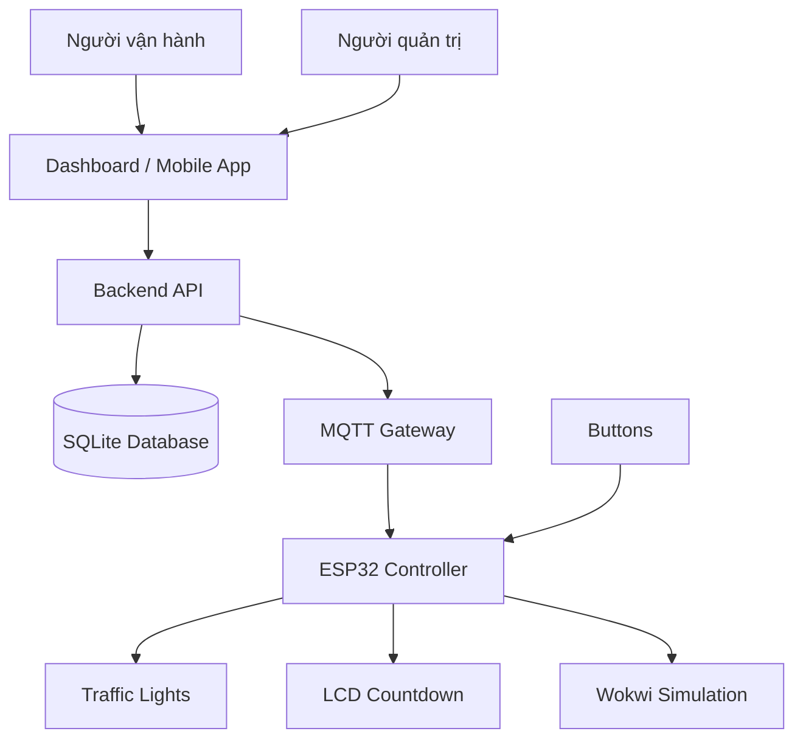
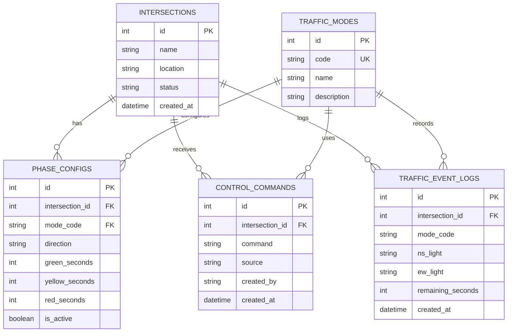
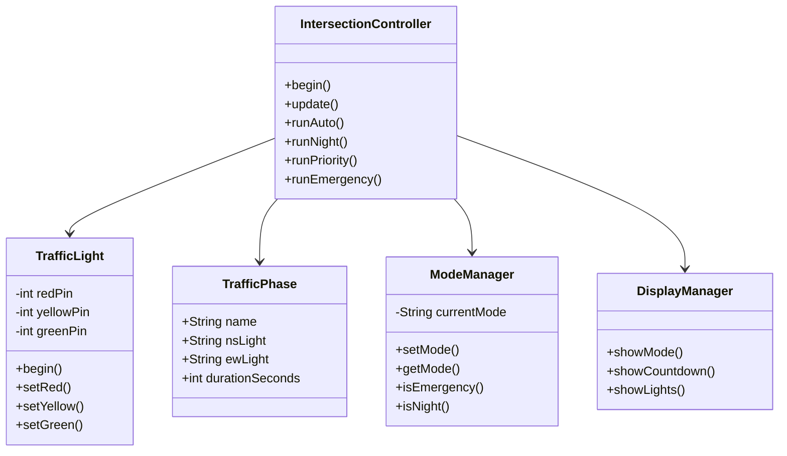
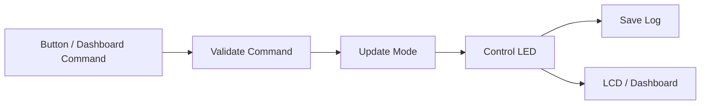

# 09. Sơ Đồ Thiết Kế Dự Án

## ERD có phù hợp dự án không?

Có, ERD phù hợp với hệ thống IoT Traffic Light mở rộng theo hướng có dashboard/mobile app và database quản lý.

Phần mô phỏng Wokwi có thể hoạt động độc lập, tuy nhiên database giúp hệ thống có chiều sâu hơn:

- Lưu cấu hình thời gian các pha đèn.
- Lưu chế độ hoạt động của hệ thống.
- Lưu lịch sử lệnh điều khiển.
- Lưu log trạng thái đèn theo thời gian.
- Hỗ trợ mở rộng backend/API thực tế.

Mô hình triển khai:

- ESP32/Wokwi: mô phỏng thiết bị.
- Backend: xử lý lệnh.
- Database: lưu dữ liệu quản lý.

---

# Danh sách sơ đồ trong báo cáo

| Sơ đồ | Đưa vào report | Mục đích |
|-|-|-|
| Kiến trúc hệ thống | Có | Mô tả các thành phần IoT |
| ERD Database | Có | Thiết kế CSDL |
| State Machine | Có | Thuật toán điều khiển đèn |
| Class Diagram | Có | Thể hiện OOP |
| Sequence Diagram | Có | Mô tả luồng gửi lệnh |

---

# 1. Sơ đồ kiến trúc tổng thể



---

# 2. ERD / Database Schema



---

# Giải thích database

## intersections

Lưu thông tin giao lộ.

Ví dụ:

- tên giao lộ
- vị trí
- trạng thái hiện tại


## traffic_modes

Lưu các chế độ:

- AUTO
- NIGHT
- PRIORITY
- EMERGENCY


## phase_configs

Lưu cấu hình thời gian đèn:

- xanh
- vàng
- đỏ


## control_commands

Lưu các lệnh từ:

- dashboard
- mobile app


## traffic_event_logs

Lưu lịch sử hoạt động:

- trạng thái đèn
- countdown
- thời gian xảy ra

---

# 3. State Machine điều khiển đèn

## State Diagram

```mermaid
stateDiagram-v2


[*] --> AUTO_NS_GREEN


AUTO_NS_GREEN --> AUTO_NS_YELLOW:
hết thời gian xanh Bắc Nam


AUTO_NS_YELLOW --> AUTO_EW_GREEN:
hết thời gian vàng Bắc Nam


AUTO_EW_GREEN --> AUTO_EW_YELLOW:
hết thời gian xanh Đông Tây


AUTO_EW_YELLOW --> AUTO_NS_GREEN:
hết thời gian vàng Đông Tây


AUTO_NS_GREEN --> NIGHT:
lệnh NIGHT

AUTO_EW_GREEN --> NIGHT:
lệnh NIGHT


NIGHT --> NIGHT:
vàng nhấp nháy


NIGHT --> AUTO_NS_GREEN:
lệnh AUTO


AUTO_NS_GREEN --> PRIORITY_NS:
ưu tiên Bắc Nam


AUTO_EW_GREEN --> PRIORITY_EW:
ưu tiên Đông Tây


PRIORITY_NS --> AUTO_NS_GREEN:
hoàn thành


PRIORITY_EW --> AUTO_NS_GREEN:
hoàn thành


AUTO_NS_GREEN --> EMERGENCY:
lệnh EMERGENCY


AUTO_EW_GREEN --> EMERGENCY:
lệnh EMERGENCY


NIGHT --> EMERGENCY:
lệnh EMERGENCY


EMERGENCY --> AUTO_NS_GREEN:
lệnh AUTO
```

---

# Pseudo Code điều khiển

```text
START


while system running:


    read current mode


    if mode == EMERGENCY:

        turn all lights RED


    else if mode == PRIORITY:

        give green light to priority direction


    else if mode == NIGHT:

        blink yellow lights


    else:

        run AUTO sequence


END
```

---

# 4. Class Diagram / OOP



---

# 5. Sequence Flow điều khiển

```mermaid
sequenceDiagram


actor User

participant UI as Dashboard

participant API as Backend

participant DB as Database

participant ESP32

participant Wokwi


User->>UI:
chọn chế độ


UI->>API:
gửi command


API->>DB:
lưu command


API->>ESP32:
gửi lệnh


ESP32->>Wokwi:
đổi trạng thái LED


ESP32->>API:
gửi status


API->>DB:
lưu log


API->>UI:
trả trạng thái

```

---

# 6. Mobile App Command Flow

```mermaid
sequenceDiagram


actor Operator

participant App

participant API

participant MQTT

participant ESP32

participant Light


Operator->>App:
chọn AUTO/NIGHT/PRIORITY/EMERGENCY


App->>API:
POST command


API->>MQTT:
publish message


MQTT->>ESP32:
receive command


ESP32->>Light:
update LED


ESP32->>MQTT:
publish status


MQTT->>API:
status event


API->>App:
update display

```

---

# 7. Data Flow



---

# Diagram Images

Sau khi export Mermaid:

```
assets/diagrams/erd.png

assets/diagrams/state_machine.png
```

Dùng cho report và slide.

---

# Cách dùng trong báo cáo

- Kiến trúc hệ thống: phần tổng quan.
- ERD: phần thiết kế database.
- State machine: phần thuật toán.
- Class diagram: phần OOP.
- Sequence: phần IoT communication.