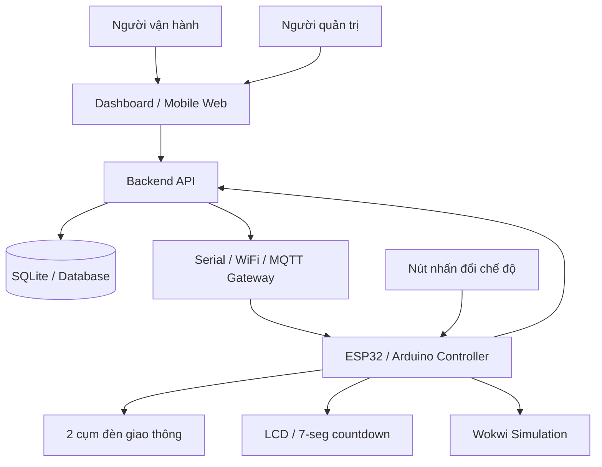
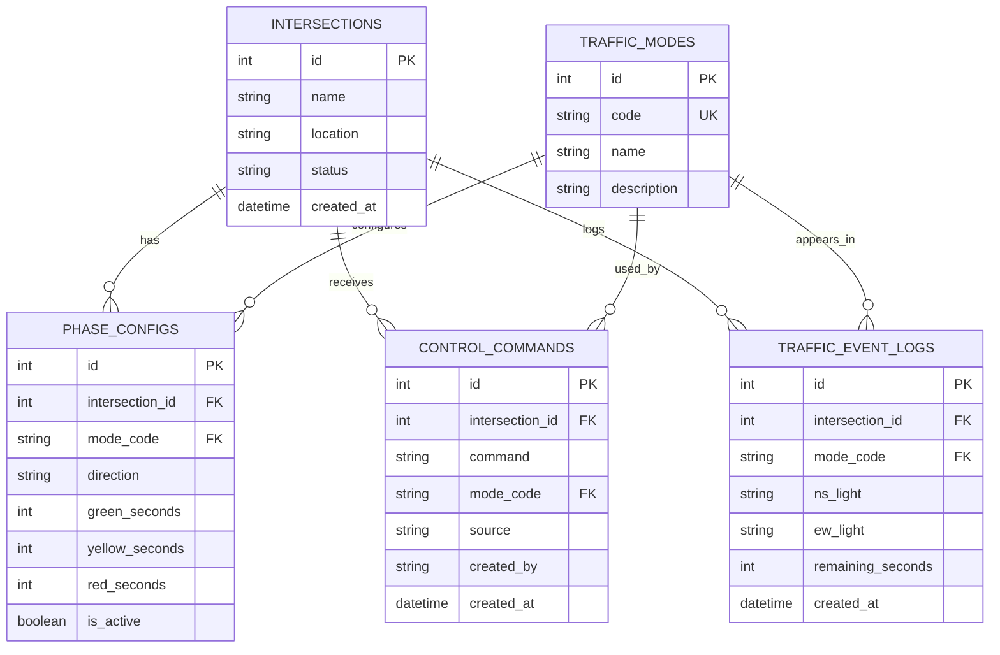
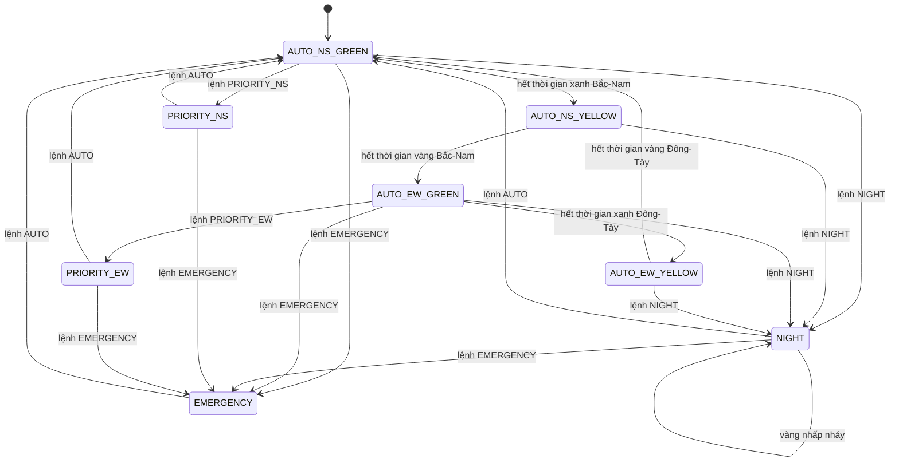
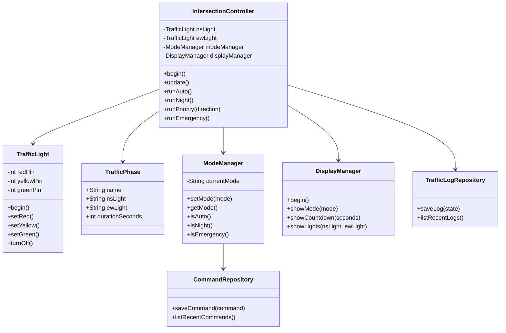
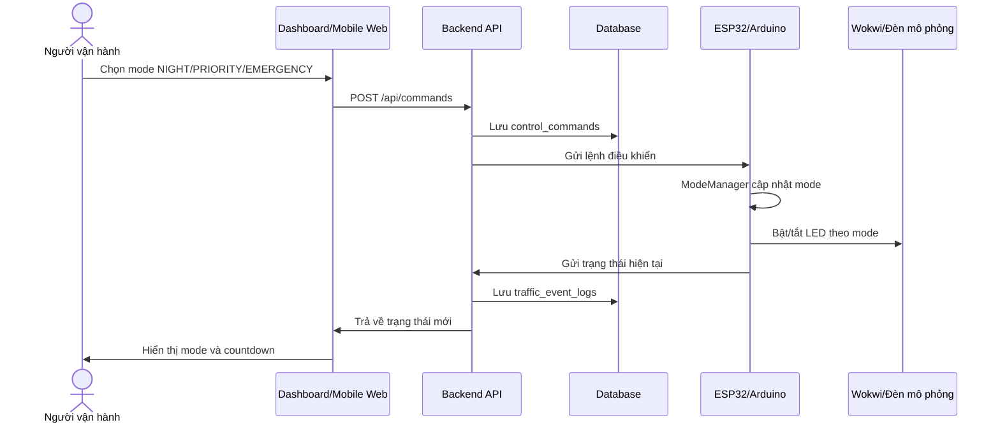
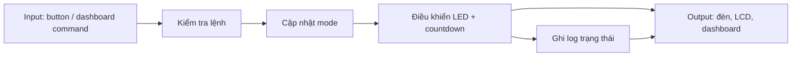

# 09. Sơ Đồ Thiết Kế Dự Án

## ERD có phù hợp dự án không?

Có, ERD phù hợp nếu nhóm trình bày hệ thống theo hướng IoT có dashboard/mobile app và database quản lý. Phần mô phỏng Wokwi không bắt buộc database để chạy, nhưng database giúp bài lớn có chiều sâu hơn vì thể hiện được:

- Lưu cấu hình thời gian pha đèn.
- Lưu lịch sử lệnh điều khiển từ dashboard/mobile app.
- Lưu log trạng thái đèn theo thời gian.
- Có cơ sở để mở rộng sang backend/API thật.

Vì vậy cách trình bày tốt nhất là: Wokwi mô phỏng phần thiết bị, còn ERD/database mô tả phần hệ thống quản lý khi triển khai thực tế.

## Danh sách sơ đồ nên đưa vào báo cáo

| Sơ đồ | Có nên đưa vào report? | Mục đích |
|---|---:|---|
| Kiến trúc tổng thể | Có | Cho thấy app, backend, database và thiết bị mô phỏng liên kết thế nào |
| ERD/CSDL | Có | Thể hiện thiết kế database và dữ liệu log |
| State machine | Có | Giải thích thuật toán điều khiển đèn |
| Class diagram/OOP | Có | Thể hiện áp dụng OOP vào code |
| Sequence gửi lệnh | Nên có | Giải thích flow app gửi lệnh điều khiển |

## 1. Sơ đồ kiến trúc tổng thể

## 2. ERD / Database schema

## 3. State machine điều khiển đèn

## 4. Class diagram / OOP

## 5. Sequence flow khi người dùng đổi chế độ

## 6. Data flow rút gọn

## Cách dùng trong báo cáo

- Dùng sơ đồ kiến trúc ở phần tổng quan hệ thống.
- Dùng ERD ở phần thiết kế CSDL.
- Dùng state machine ở phần thuật toán điều khiển.
- Dùng class diagram ở phần áp dụng OOP.
- Dùng sequence flow ở phần dashboard/mobile app điều khiển.

