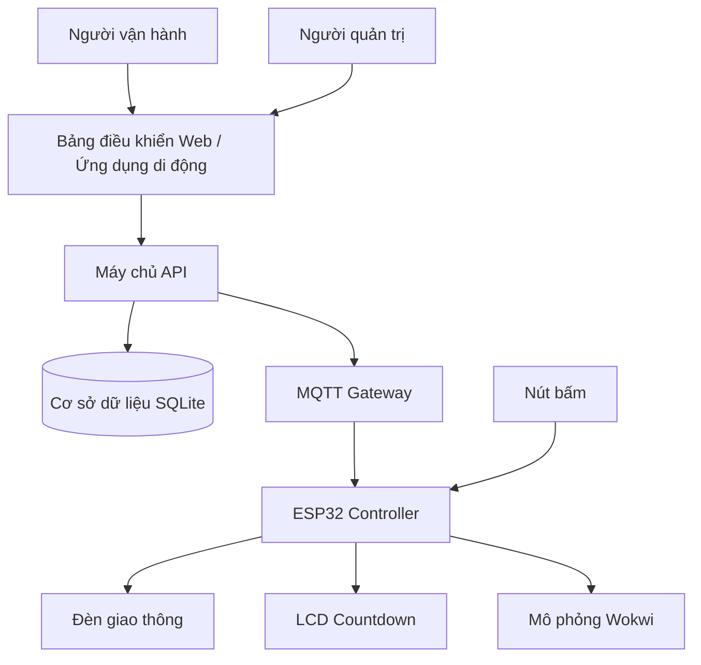
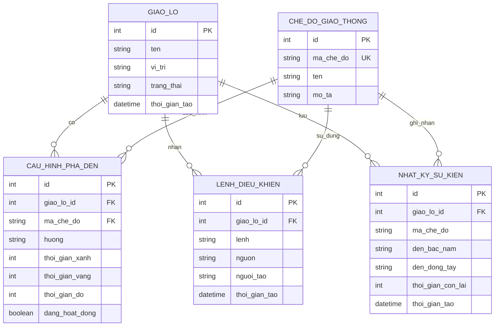
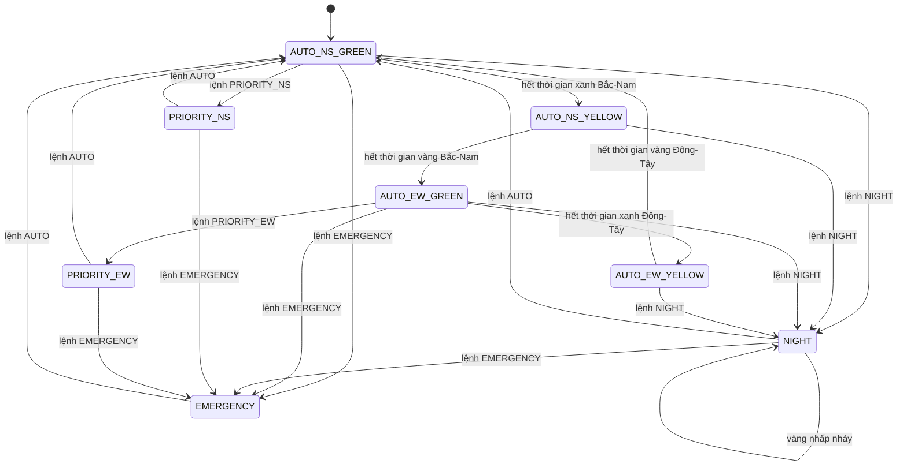
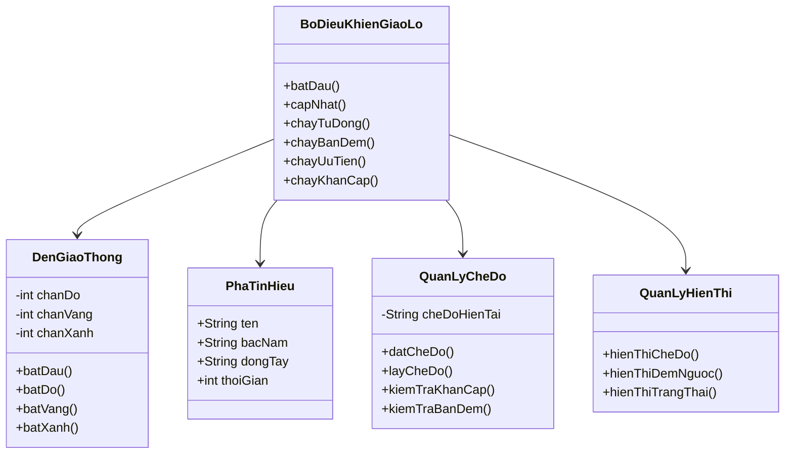
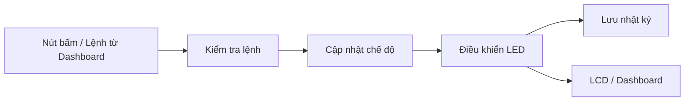

# 09. Sơ Đồ Thiết Kế Dự Án

## ERD có phù hợp dự án không?

Có, ERD phù hợp với hệ thống IoT Traffic Light mở rộng theo hướng có bảng điều khiển web / ứng dụng di động và cơ sở dữ liệu quản lý.

Phần mô phỏng Wokwi có thể hoạt động độc lập, tuy nhiên cơ sở dữ liệu giúp hệ thống có chiều sâu hơn:

- Lưu cấu hình thời gian các pha đèn.
- Lưu chế độ hoạt động của hệ thống.
- Lưu lịch sử lệnh điều khiển.
- Lưu log trạng thái đèn theo thời gian.
- Hỗ trợ mở rộng backend/API thực tế.

Mô hình triển khai:

- ESP32/Wokwi: mô phỏng thiết bị.
- Máy chủ: xử lý lệnh.
- Cơ sở dữ liệu: lưu dữ liệu quản lý.

---

# Danh sách sơ đồ trong báo cáo

| Sơ đồ | Đưa vào report | Mục đích |
|-|-|-|
| Kiến trúc hệ thống | Có | Mô tả các thành phần IoT |
| ERD Database | Có | Thiết kế cơ sở dữ liệu |
| State Machine | Có | Thuật toán điều khiển đèn |
| Class Diagram | Có | Thể hiện lập trình hướng đối tượng |
| Sequence Diagram | Có | Mô tả luồng gửi lệnh |

---

# 1. Sơ đồ kiến trúc tổng thể



---

# 2. ERD / Database Schema



---

# Giải thích database

## giao_lo

Lưu thông tin giao lộ.

Ví dụ:

- tên giao lộ
- vị trí
- trạng thái hiện tại


## che_do_giao_thong

Lưu các chế độ:

- AUTO
- NIGHT
- PRIORITY
- EMERGENCY


## cau_hinh_pha_den

Lưu cấu hình thời gian đèn:

- xanh
- vàng
- đỏ


## lenh_dieu_khien

Lưu các lệnh từ:

- bảng điều khiển
- ứng dụng di động


## nhat_ky_su_kien

Lưu lịch sử hoạt động:

- trạng thái đèn
- countdown
- thời gian xảy ra

---

# 3. State Machine điều khiển đèn

## State Diagram



---

# Pseudo Code điều khiển

```text
START

while hệ thống đang chạy:

    đọc chế độ hiện tại

    nếu chế độ == EMERGENCY:

        bật tất cả đèn đỏ


    ngược lại nếu chế độ == PRIORITY:

        cho hướng ưu tiên đèn xanh


    ngược lại nếu chế độ == NIGHT:

        nhấp nháy đèn vàng


    ngược lại:

        chạy chu trình AUTO


END
```

---

# 4. Class Diagram / OOP



---

# 5. Sequence Flow điều khiển

```mermaid
sequenceDiagram

actor NguoiDung

participant BangDieuKhien

participant MayChu

participant CoSoDuLieu

participant ESP32

participant Wokwi


NguoiDung->>BangDieuKhien:
chọn chế độ


BangDieuKhien->>MayChu:
gửi lệnh


MayChu->>CoSoDuLieu:
lưu lệnh


MayChu->>ESP32:
gửi command


ESP32->>Wokwi:
đổi trạng thái LED


ESP32->>MayChu:
gửi trạng thái


MayChu->>CoSoDuLieu:
lưu log


MayChu->>BangDieuKhien:
trả trạng thái


```

---

# 6. Mobile App Command Flow

```mermaid
sequenceDiagram

actor NguoiVanHanh

participant UngDung

participant MayChu

participant MQTT

participant ESP32

participant Den


NguoiVanHanh->>UngDung:
chọn AUTO/NIGHT/PRIORITY/EMERGENCY


UngDung->>MayChu:
POST command


MayChu->>MQTT:
publish message


MQTT->>ESP32:
receive command


ESP32->>Den:
update LED


ESP32->>MQTT:
publish status


MQTT->>MayChu:
status event


MayChu->>UngDung:
update display


```

---

# 7. Data Flow



---

# Diagram Images

Sau khi export Mermaid:

```
assets/diagrams/erd.png

assets/diagrams/state_machine.png
```

Dùng cho report và slide.

---

# Cách dùng trong báo cáo

- Kiến trúc hệ thống: phần tổng quan.
- ERD: phần thiết kế database.
- State machine: phần thuật toán.
- Class diagram: phần OOP.
- Sequence: phần IoT communication.