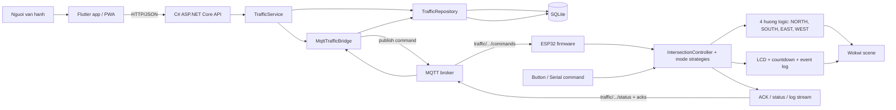
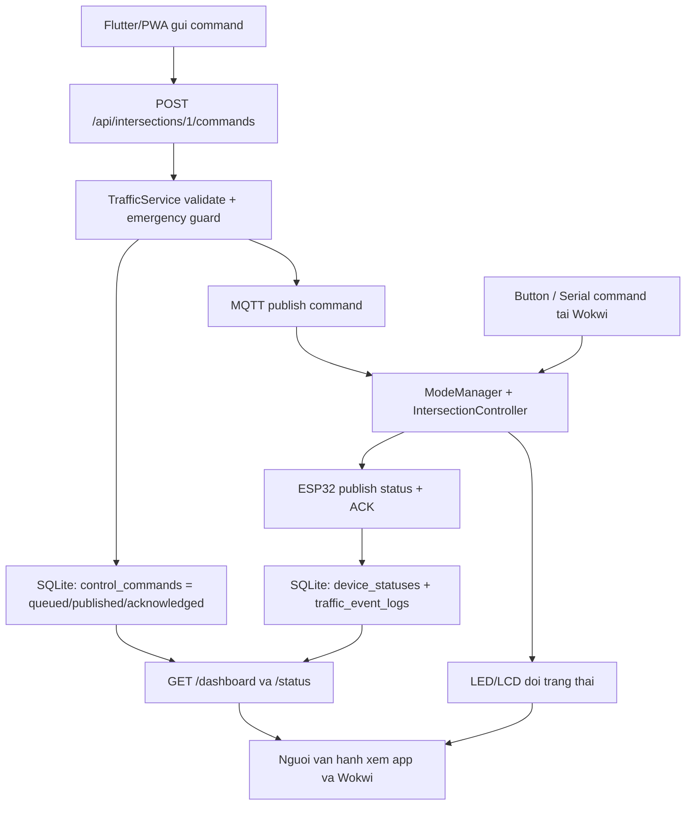
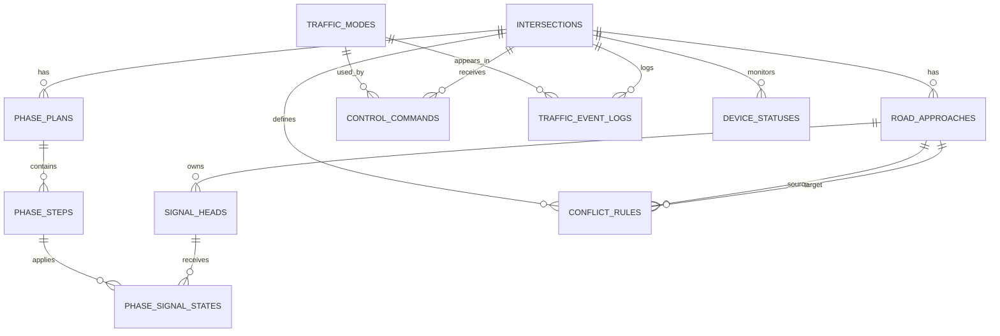
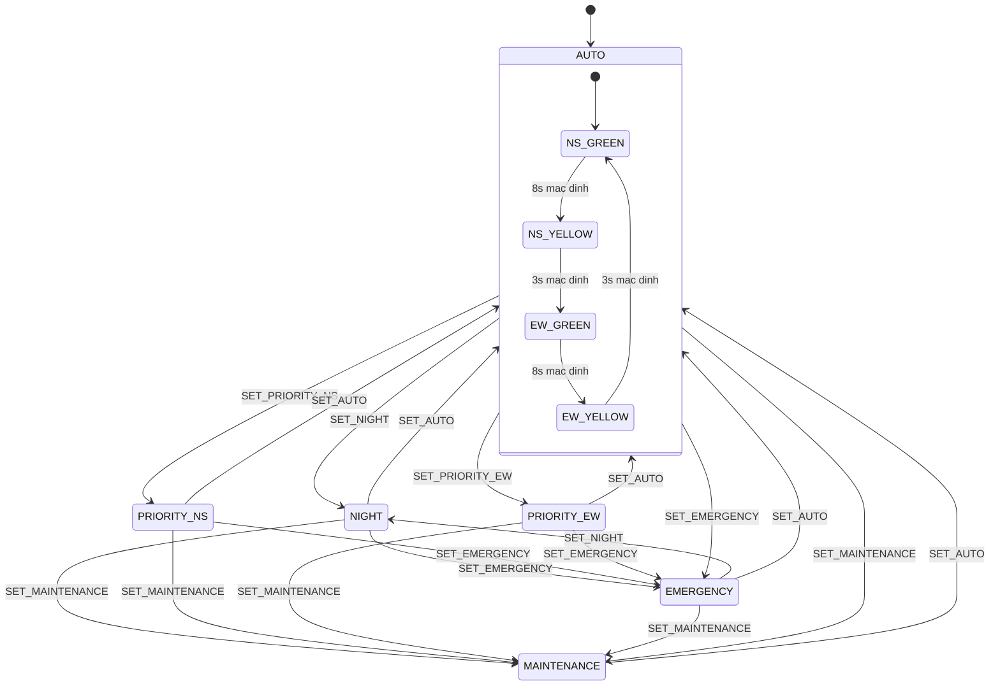
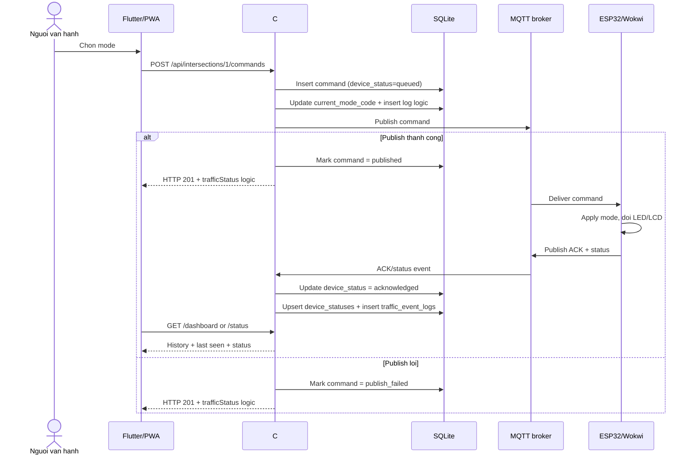
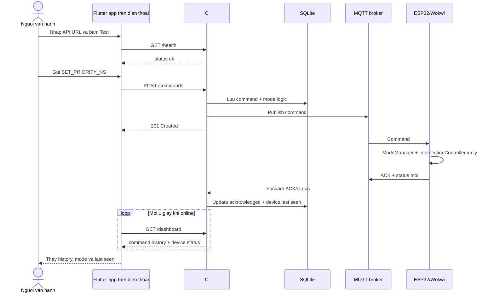

# 09. Sơ Đồ Thiết Kế Dự Án

> Cập nhật theo repository ngày 28/06/2026. Source Mermaid trong `assets/diagrams/` là bộ sơ đồ gốc để đưa sang report/PPT.

## 1. Nguyên tắc trình bày cho đúng thực tế

- Wokwi là lớp **thiết bị mô phỏng**, không phải toàn bộ hệ thống.
- App không điều khiển trực tiếp ESP32; luồng đúng là **Flutter/PWA -> C# API -> MQTT -> ESP32/Wokwi**.
- SQLite là phần backend quản lý phase plan, command history, device status và log; không phải thành phần bắt buộc để firmware tự chạy AUTO/NIGHT/PRIORITY/EMERGENCY.
- Dashboard có thể hiển thị **trạng thái logic backend** trước khi thiết bị ACK. Vì vậy khi demo cần phân biệt `HTTP 201`, `published` và `acknowledged`.
- Wokwi đang hiển thị 4 hướng logic `NORTH/SOUTH/EAST/WEST`, nhưng phần cứng mô phỏng hiện dùng **2 nhóm GPIO độc lập**: một nhóm cho trục Bắc-Nam, một nhóm cho trục Đông-Tây.

## 2. Danh sách sơ đồ nên dùng

| Sơ đồ | File nguồn | Mục đích |
|---|---|---|
| Kiến trúc tổng thể | `assets/diagrams/architecture.mmd` | Thể hiện app, backend, MQTT, SQLite và thiết bị |
| Luồng dữ liệu | `assets/diagrams/data_flow.mmd` | Phân biệt command từ app với input local ở Wokwi |
| ERD / schema | `assets/diagrams/erd.mmd` | Bám đúng schema SQLite hiện tại |
| State machine | `assets/diagrams/state_machine.mmd` | Mô tả AUTO 8s/3s, các mode và service mode |
| Sequence command | `assets/diagrams/sequence_command.mmd` | Giải thích publish, ACK và lịch sử command |
| Sequence mobile demo | `assets/diagrams/mobile_command_flow.mmd` | Giải thích demo app trên điện thoại |
| Class diagram / OOP | `assets/diagrams/class_diagram.mmd` | Thể hiện OOP ở firmware + backend bridge |

## 3. Sơ đồ kiến trúc tổng thể

## 4. Luồng dữ liệu chính

## 5. ERD / Database schema

ERD hiện tại bám đúng `backend/schema.sql`, không còn dừng ở mô hình cũ chỉ có `intersections`, `phase_configs`, `control_commands`, `traffic_event_logs`.

## 6. State machine điều khiển

Ghi chú:

- `AUTO` dùng chu kỳ mặc định `8s xanh / 3s vàng / 8s xanh / 3s vàng`.
- `MAINTENANCE` có trong firmware như service mode, nhưng không phải mode chính đang expose ở app cho buổi demo thông thường.
- Backend hiện cho chỉnh phase plan ở SQLite, nhưng **chưa tự động đồng bộ** duration đó xuống firmware qua luồng app chuẩn.

## 7. Class diagram / OOP

```mermaid
classDiagram
    class TrafficLight {
        +begin()
        +setColor(color)
        +turnOff()
    }

    class RoadApproach {
        +setColor(color)
        +allOff()
        +name()
    }

    class PedestrianSignal {
        +setWalk(enabled)
    }

    class ModeManager {
        +setMode(mode)
        +cycleButtonMode()
        +parseCommand(command)
    }

    class PhaseConfig {
        +greenSeconds()
        +yellowSeconds()
        +setDuration(phase, seconds)
    }

    class DisplayManager {
        +showMode(mode)
        +showPhase(phase)
        +showCountdown(seconds)
    }

    class EventLog {
        +add(level, message)
        +recentEntries()
    }

    class IModeStrategy {
        <<interface>>
        +enter()
        +tick(nowMs)
        +phaseCode()
    }

    class AutoMode
    class NightMode
    class PriorityNSMode
    class PriorityEWMode
    class EmergencyMode
    class MaintenanceMode

    class IntersectionController {
        +begin()
        +update()
        +applyExternalCommand(cmd)
        +buildStatusJson()
    }

    class MqttClientManager {
        +connect()
        +handleIncomingCommand()
        +publishStatus()
        +publishAck()
    }

    class TrafficRepository {
        +InsertCommandAsync()
        +MarkCommandPublishedAsync()
        +UpsertDeviceStatusAsync()
    }

    class TrafficService {
        +HandleCommandAsync()
        +GetDashboardAsync()
        +UpdatePhasePlanDurationsAsync()
    }
```

Điểm cần nói khi thuyết trình:

- Firmware áp dụng OOP rõ nhất ở `ModeManager`, `IntersectionController` và nhóm `IModeStrategy`.
- Backend áp dụng service/repository + interface publisher.
- Flutter cũng có tách model/view/client, nhưng nếu cần một class diagram ngắn gọn thì nên ưu tiên firmware + backend như trên để sát phần điều khiển IoT.

## 8. Sequence flow khi gửi lệnh

Điểm quan trọng để tránh nói sai:

- `HTTP 201` chi cho biết API da nhan va xu ly nghiep vu.
- `published` chi cho biết backend da publish len broker.
- `acknowledged` moi la bang chung manh nhat rang ESP32/Wokwi da nhan lenh.

## 9. Sequence mobile demo

## 10. Khuyen nghi khi dua vao report/PPT

- Neu can ngan gon, uu tien 4 so do: **kien truc tong the, ERD, state machine, sequence command**.
- Neu giang vien hoi ve OOP, mo them class diagram va noi ro phan strategy mode trong firmware.
- Neu giang vien hoi ve database, dung ERD moi; khong quay lai mo hinh cu chi co 4 bang.
- Neu giang vien hoi ve app, noi dung chuan la: app dieu khien backend, backend dieu phoi MQTT, Wokwi mo phong thiet bi.
