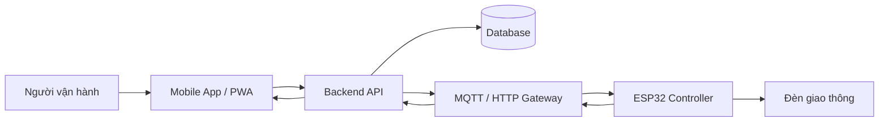

# 12. Mobile App Điều Khiển - Implement Và Hướng Phát Triển

## Kết luận khả thi

Khả thi và phù hợp với đề tài IoT, nhưng nên trình bày theo 2 lớp:

- **Trong demo hiện tại:** dùng mobile web/PWA mock để mô phỏng màn hình điều khiển, lịch sử lệnh và trạng thái giao lộ.
- **Trong triển khai thực tế:** app mobile gửi lệnh qua backend API hoặc MQTT broker; ESP32 nhận lệnh qua WiFi và gửi trạng thái ngược lại.

Không nên nói app mobile điều khiển trực tiếp Wokwi, vì Wokwi chủ yếu là môi trường mô phỏng. Cách nói đúng hơn là: Wokwi mô phỏng thiết bị, mobile app mô phỏng lớp vận hành/giám sát.

## Implement đã bổ sung

| File | Vai trò |
|---|---|
| `mobile_app/index.html` | Giao diện mobile điều khiển |
| `mobile_app/styles.css` | Giao diện responsive/PWA |
| `mobile_app/app.js` | Logic mock state machine, command history, countdown |
| `mobile_app/manifest.webmanifest` | Cấu hình PWA cơ bản |
| `assets/diagrams/mobile_command_flow.mmd` | Sequence flow app gửi lệnh đến ESP32 |

## Chức năng mobile mock

- Hiển thị mode hiện tại.
- Hiển thị pha hiện tại và countdown.
- Hiển thị trạng thái đèn Bắc-Nam và Đông-Tây.
- Gửi lệnh mock: `AUTO`, `NIGHT`, `PRIORITY NS`, `PRIORITY EW`, `EMERGENCY`.
- Cấu hình thời gian đèn xanh/vàng ở mức local mock.
- Lưu lịch sử lệnh trong `localStorage`.

## Kiến trúc đề xuất để đưa vào báo cáo



## API phù hợp thực tế

| Method | Endpoint | Mục đích |
|---|---|---|
| `GET` | `/api/status` | Lấy trạng thái hiện tại |
| `POST` | `/api/commands` | Gửi lệnh đổi mode |
| `GET` | `/api/commands` | Xem lịch sử lệnh |
| `GET` | `/api/phase-configs` | Xem cấu hình pha |
| `PUT` | `/api/phase-configs/:id` | Cập nhật thời gian pha |

Ví dụ body gửi lệnh:

```json
{
  "intersectionId": 1,
  "command": "SET_NIGHT",
  "source": "mobile",
  "createdBy": "operator"
}
```

## Lộ trình tối ưu

### Mức 1 - Đủ nộp, ít rủi ro

- Wokwi chạy đủ 4 mode.
- Mobile app mock thể hiện màn hình điều khiển và lịch sử lệnh.
- Report ghi rõ app hiện là mock UI, chưa kết nối trực tiếp thiết bị.

### Mức 2 - Có backend mô phỏng

- Tạo API nhỏ bằng Node.js/Express hoặc Python FastAPI.
- Mobile app gọi `POST /api/commands`.
- Database SQLite lưu `control_commands` và `traffic_event_logs`.
- ESP32/Wokwi vẫn chạy độc lập nhưng báo cáo thể hiện được flow thực tế.

### Mức 3 - Gần thực tế IoT

- Dùng ESP32 thật hoặc Wokwi + MQTT bridge nếu có điều kiện.
- App gửi lệnh qua MQTT topic như `traffic/intersection-1/commands`.
- ESP32 publish trạng thái qua `traffic/intersection-1/status`.
- Dashboard/mobile đọc trạng thái realtime.

## Đề xuất chốt cho nhóm

Với deadline môn học và không có phần cứng thật, nên chọn **Mức 1 + thiết kế rõ Mức 2/Mức 3**. Đây là hướng cân bằng nhất:

- Demo không bị phụ thuộc phần cứng.
- Vẫn thể hiện IoT, database, OOP, mobile app và kiến trúc thực tế.
- Dễ trình bày trong slide: Wokwi là lớp thiết bị, mobile app là lớp vận hành, database/backend là lớp mở rộng.
