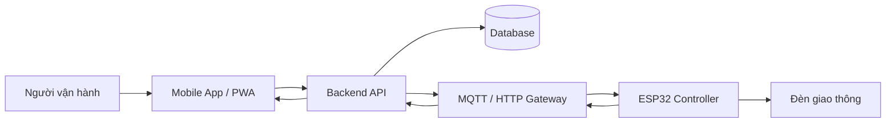

# 12. Mobile App Điều Khiển - Implement Và Hướng Phát Triển

## Kết luận khả thi

Khả thi và phù hợp với đề tài IoT. Ở trạng thái hiện tại, dự án đã có cả hai lớp:

- **Trong demo hiện tại:** PWA trong `mobile_app/` và Flutter app source trong `flutter_app/` gọi backend C# thật.
- **Trong triển khai mô phỏng thiết bị:** backend publish command qua MQTT broker để ESP32/Wokwi nhận lệnh và gửi ACK/status ngược lại.

Không nên nói app mobile điều khiển trực tiếp Wokwi. Cách nói đúng hơn là: app/PWA điều khiển backend, backend điều phối MQTT, còn Wokwi mô phỏng lớp thiết bị.

## Implement đã bổ sung

| File | Vai trò |
|---|---|
| `mobile_app/index.html` | Giao diện mobile điều khiển |
| `mobile_app/styles.css` | Giao diện responsive/PWA |
| `mobile_app/app.js` | Logic gọi backend, dashboard, phase plan, history và settings |
| `mobile_app/manifest.webmanifest` | Cấu hình PWA cơ bản |
| `flutter_app/lib/main.dart` | Flutter operator app source |
| `backend/Program.cs` | REST API, SQLite và MQTT bridge |
| `assets/diagrams/mobile_command_flow.mmd` | Sequence flow app gửi lệnh đến ESP32 |

## Chức năng hiện có

- Hiển thị mode hiện tại.
- Hiển thị pha hiện tại và countdown.
- Hiển thị trạng thái bốn hướng NORTH/SOUTH/EAST/WEST.
- Gửi lệnh `AUTO`, `NIGHT`, `PRIORITY NS`, `PRIORITY EW`, `EMERGENCY` qua API.
- Xem command history từ SQLite backend.
- Xem phase plan, device status, roads/approaches và metrics.
- PWA lưu `API base URL` vào `localStorage`; Flutter lưu cấu hình qua `SharedPreferences`.

## Kiến trúc đề xuất để đưa vào báo cáo



## API phù hợp thực tế

| Method | Endpoint | Mục đích |
|---|---|---|
| `GET` | `/api/intersections/1/dashboard` | Lấy snapshot dashboard |
| `GET` | `/api/intersections/1/status` | Lấy trạng thái hiện tại |
| `POST` | `/api/intersections/1/commands` | Gửi lệnh đổi mode |
| `GET` | `/api/intersections/1/commands` | Xem lịch sử lệnh |
| `GET` | `/api/intersections/1/phase-plans` | Xem phase plan |
| `PUT` | `/api/phase-plans/:id` | Cập nhật thời gian pha |

Ví dụ body gửi lệnh:

```json
{
  "intersectionId": 1,
  "command": "SET_NIGHT",
  "source": "mobile",
  "createdBy": "operator"
}
```

## Lộ trình tối ưu

### Mức hiện tại - Đã triển khai trong repo

- Wokwi chạy đủ 5 mode chính: `AUTO`, `NIGHT`, `PRIORITY_NS`, `PRIORITY_EW`, `EMERGENCY`.
- PWA và Flutter app gọi backend C# thật.
- SQLite lưu command history, phase plan, approaches, signal heads, logs và device status.
- Backend publish command qua MQTT và nhận ACK/status từ Wokwi.

### Mức nâng cấp tiếp theo

- Đồng bộ phase duration backend -> firmware theo command cấu hình có xác nhận áp dụng.
- Tăng an toàn đèn: all-red clearance, conflict enforcement, watchdog.
- Hoàn thiện bảo mật và độ tin cậy production: auth, TLS, retry, outbox, idempotency.

## Đề xuất chốt cho nhóm

Với trạng thái repo hiện tại, nên trình bày dự án theo ba lớp:

- Wokwi/ESP32 là lớp thiết bị.
- Backend C# + SQLite + MQTT là lớp điều phối.
- PWA/Flutter là lớp vận hành.

Đây là cách kể đúng nhất với source hiện tại và cũng là cách dễ ăn điểm nhất khi trình bày.
