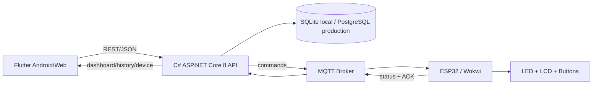

# Kế hoạch triển khai hoàn chỉnh - IoT Traffic Light

> Cập nhật: 15/06/2026
> Mục tiêu: hoàn thiện sản phẩm bài tập lớn có thể demo end-to-end bằng điện thoại Android và Wokwi.

## 1. Kết quả cuối cần đạt

Luồng nghiệm thu chính:

```text
Flutter Android
-> C# ASP.NET Core API
-> SQLite lưu command
-> MQTT broker
-> ESP32/Wokwi đổi đèn
-> ESP32 publish ACK/status
-> Backend cập nhật history/device
-> Flutter hiển thị kết quả
```

Sản phẩm chỉ được xem là hoàn thành khi có đủ:

- Source code Flutter, C# backend và ESP32/Wokwi.
- APK Android cài được.
- Backend build và smoke/integration test đạt.
- Wokwi compile và chạy được với WiFi/MQTT.
- Video end-to-end app điều khiển Wokwi.
- Ảnh năm mode: AUTO, NIGHT, PRIORITY_NS, PRIORITY_EW, EMERGENCY.
- Report giải thích kiến trúc, OOP, database, state machine, MQTT và giới hạn production.
- Slide thuyết trình và checklist demo.

## 2. Kiến trúc chốt



Quyết định kỹ thuật:

- C# là stack chính cho backend và nghiệp vụ.
- ESP32 dùng Arduino C++ vì đây là ngôn ngữ phù hợp với firmware/Wokwi.
- Flutter là mobile app thật.
- MQTT là kênh IoT realtime.
- SQLite dùng cho local/demo; không gọi là database production trên Render Free.
- Wokwi và backend cùng kết nối outbound đến broker public, không cần Wokwi gọi vào localhost.

## 3. Trạng thái tổng quan

| Workstream | Code | Test cục bộ | Evidence thực tế | Trạng thái |
|---|---:|---:|---:|---|
| C# API + SQLite | Có | Có | Build/test pass | Gần hoàn tất |
| MQTT bridge backend | Có | Đã kết nối broker | Chưa có video ACK từ Wokwi | Cần nghiệm thu E2E |
| ESP32/Wokwi firmware | Có | Đang rà soát | Chưa có compile log/video cuối | Cần nghiệm thu Wokwi |
| Flutter Dashboard/Control | Có | Analyze/test/build đạt | Đã kiểm tra Web | Hoàn tất code |
| Flutter Manage/History/Settings | Có | Analyze/test đạt | Desktop/mobile QA đạt | Gần hoàn tất |
| Android APK | Có | Release build đạt | Chưa cài trên điện thoại thật | Cần cài thử |
| Report/OOP/docs | Có bản Markdown | Đã review nội dung | Chưa xuất PDF | Gần hoàn tất |
| Slide | Chưa đủ | Chưa | Chưa | Chưa triển khai |
| Media Wokwi | Chưa đủ | Chưa | Chưa | Blocking trước khi nộp |
| Deploy cloud | Có cấu hình Render | Chưa deploy URL cuối | Chưa | Tùy chọn demo |

## 4. Mức 1 - Mô phỏng giao thông cơ bản

### 4.1. Chức năng bắt buộc

- [x] Giao lộ bốn hướng NORTH/SOUTH/EAST/WEST.
- [x] Mỗi cụm hiển thị đỏ, vàng, xanh.
- [x] AUTO chạy chu kỳ NS xanh -> NS vàng -> EW xanh -> EW vàng.
- [x] NIGHT chớp vàng.
- [x] PRIORITY_NS.
- [x] PRIORITY_EW.
- [x] EMERGENCY tất cả đỏ.
- [x] LCD hiển thị mode/phase/countdown.
- [x] Nút nhấn local.
- [x] Serial command local.
- [ ] Compile lại sketch hiện tại trực tiếp trên Wokwi.
- [ ] Chụp đủ năm ảnh mode.
- [ ] Quay video local control.

### 4.2. Tiêu chí nghiệm thu Mức 1

| Test | Kết quả mong đợi | Evidence |
|---|---|---|
| Start simulation | Không có build/runtime error | Ảnh Serial + màn Wokwi |
| AUTO | Hai trục không cùng xanh | Video một chu kỳ |
| NIGHT | Vàng chớp khoảng 500 ms | Ảnh/video |
| PRIORITY_NS | NS xanh, EW đỏ | Ảnh |
| PRIORITY_EW | EW xanh, NS đỏ | Ảnh |
| EMERGENCY | Tất cả đỏ | Ảnh |
| MQTT mất kết nối | Button/Serial vẫn dùng được | Video ngắn hoặc mô tả test |

## 5. Mức 2 - Product IoT có app và backend

### 5.1. Backend C#

Đã triển khai:

- [x] ASP.NET Core 8 Minimal API.
- [x] SQLite schema và seed dữ liệu.
- [x] Intersection, approaches, signal heads, phase plans.
- [x] Command history và traffic logs.
- [x] Device status.
- [x] MQTT publish command.
- [x] MQTT subscribe status/ACK.
- [x] Command lifecycle `queued`, `published`, `acknowledged`, `publish_failed`.
- [x] Dashboard snapshot.
- [x] API phase plan và road approach.
- [x] Health và MQTT status endpoint.

Cần hoàn thiện:

- [x] Integration test cho các API Flutter đang dùng.
- [x] Test DB riêng, không phá `traffic.db` dev.
- [x] Test command lifecycle khi MQTT bật/tắt.
- [x] Test emergency guard.
- [x] Test update/activate phase plan.
- [x] Test bật/tắt road approach.
- [x] Ghi lại output build/test làm evidence.

API contract bắt buộc:

| Method | Endpoint | Flutter sử dụng |
|---|---|---|
| GET | `/api/health` | Test kết nối |
| GET | `/api/intersections/1/dashboard` | Dashboard đầy đủ |
| GET | `/api/intersections/1/status` | Polling trạng thái |
| POST | `/api/intersections/1/commands` | Gửi mode |
| GET | `/api/intersections/1/commands` | History |
| GET | `/api/intersections/1/logs` | Device logs |
| PUT | `/api/phase-plans/{id}` | Sửa thời lượng |
| POST | `/api/phase-plans/{id}/activate` | Kích hoạt plan |
| PUT | `/api/approaches/{id}` | Bật/tắt hướng |
| GET | `/api/intersections/1/devices` | Online/last seen |
| GET | `/api/mqtt/status` | Broker state |

### 5.2. Flutter app

Đã triển khai:

- [x] Dashboard: mode, phase, countdown, bốn cụm đèn.
- [x] Control: AUTO, NIGHT, PRIORITY_NS, PRIORITY_EW, EMERGENCY.
- [x] Manage/Phase plan: sửa green/yellow seconds, activate.
- [x] Manage/Roads: xem signal head/pin, bật/tắt approach.
- [x] History: command lifecycle và logs.
- [x] Settings: nhập API URL, test backend, xem ESP32 device.
- [x] Responsive Web/mobile layout.
- [x] HTTP timeout và lỗi kết nối.
- [x] Android Internet permission.
- [x] Android cleartext HTTP cho demo LAN.
- [x] `flutter analyze`.
- [x] Widget test.
- [x] Web release build.
- [x] Android release APK.

Artifact:

```text
dist/android/iot-traffic-light-v1.0.0.apk
```

Cần hoàn thiện:

- [x] Browser verify màn Manage sau thay đổi mới nhất.
- [ ] Cài APK lên điện thoại thật.
- [ ] Nhập IP LAN và gọi `/api/health`.
- [ ] Gửi đủ năm command từ điện thoại.
- [ ] Chụp Dashboard, Control, Manage, History, Settings.
- [ ] Persist API URL bằng local storage/shared preferences.
- [ ] Đổi package ID mẫu.
- [ ] Tạo release keystore nếu phát hành ngoài lớp học.

### 5.3. ESP32/Wokwi MQTT

Đã triển khai trong source:

- [x] WiFi `Wokwi-GUEST`.
- [x] PubSubClient.
- [x] Kết nối broker `broker.hivemq.com:1883`.
- [x] Subscribe command topic.
- [x] Parse năm command.
- [x] Publish status.
- [x] Publish ACK theo `commandId`.
- [x] Local button/Serial fallback.

Topic chốt:

```text
traffic/hainx-iot-traffic-light/intersections/1/commands
traffic/hainx-iot-traffic-light/intersections/1/status
traffic/hainx-iot-traffic-light/intersections/1/acks
```

Cần hoàn thiện:

- [ ] Rà soát compile correctness.
- [ ] Chạy trực tiếp trên Wokwi.
- [ ] Xác nhận Serial có `MQTT connected`.
- [ ] Xác nhận backend nhận device status.
- [ ] Xác nhận command chuyển `published -> acknowledged`.
- [ ] Quay một lượt app -> API -> MQTT -> Wokwi -> ACK.

## 6. Kế hoạch thi công theo giai đoạn

### Giai đoạn A - Khóa code và build

Owner: main integration

- [x] Cài Flutter portable.
- [x] Cài Android SDK/JDK portable.
- [x] Build Web.
- [x] Build APK ngoài OneDrive bằng script.
- [x] Bổ sung màn Manage.
- [ ] Browser QA màn Manage desktop/mobile.
- [ ] Cập nhật README và status theo artifact mới.

Gate hoàn thành:

```text
flutter analyze: pass
flutter test: pass
flutter build web: pass
Android release APK: pass
```

### Giai đoạn B - Firmware verification

Owner: firmware worker + main review

- [ ] Rà soát class, brace, include và API PubSubClient.
- [ ] Kiểm tra reconnect không làm treo state machine.
- [ ] Kiểm tra parse command JSON.
- [ ] Kiểm tra ACK/status payload.
- [ ] Kiểm tra local fallback.
- [ ] Main review diff.
- [ ] Wokwi compile/run thủ công.

Gate hoàn thành:

- Sketch compile trên Wokwi.
- Broker connected.
- Năm command đổi đúng mode.
- Status và ACK về backend.

### Giai đoạn C - Backend test và hardening

Owner: backend worker + main review

- [ ] Bổ sung test contract/integration.
- [ ] Dùng temporary SQLite database.
- [ ] Build 0 error.
- [ ] Chạy smoke test.
- [ ] Main review behavior/API compatibility.

Gate hoàn thành:

- Tất cả endpoint Flutter dùng đều có test.
- Không thay đổi response contract ngoài chủ đích.
- Test không sửa database demo.

### Giai đoạn D - Tài liệu bài lớn

Owner: docs worker + main integration

- [x] Kiến trúc end-to-end.
- [x] OOP firmware/backend/Flutter.
- [x] Command lifecycle.
- [x] State machine và safety.
- [x] Ma trận tiêu chí môn IoT.
- [x] Hướng dẫn demo điện thoại.
- [x] Production gap/deploy free.
- [ ] Cập nhật artifact APK mới.
- [ ] Chèn ảnh/video thực tế.
- [ ] Xuất report PDF.
- [ ] Tạo slide.

Gate hoàn thành:

- Tài liệu không gọi `published` là device ACK.
- Phân biệt source implemented và runtime verified.
- Có link/ảnh evidence thật.

### Giai đoạn E - End-to-end acceptance

Owner: main integration + người dùng thao tác Wokwi/điện thoại

1. Chạy backend với MQTT.
2. Mở Wokwi và Start Simulation.
3. Chờ device xuất hiện ở Flutter Settings.
4. Gửi NIGHT.
5. Kiểm tra Wokwi chớp vàng.
6. Kiểm tra History là `acknowledged`.
7. Lặp lại AUTO, PRIORITY_NS, PRIORITY_EW, EMERGENCY.
8. Quay video 30-60 giây.

Gate hoàn thành:

- Device online/last seen mới.
- Ít nhất một command `acknowledged`.
- Wokwi LED/LCD đổi đúng.
- Video nhìn thấy app và Wokwi trong cùng lượt.

### Giai đoạn F - Deploy miễn phí

Phương án demo đề xuất:

| Thành phần | Nơi deploy |
|---|---|
| Android app | Cài APK trực tiếp |
| Flutter Web | Render Static Site hoặc GitHub Pages |
| C# backend | Render Free Web Service |
| MQTT | HiveMQ public broker cho demo |
| ESP32 | Wokwi share project |

Checklist:

- [ ] Deploy backend bằng `render.yaml`.
- [ ] Cấu hình `MQTT_ENABLED=true`.
- [ ] Kiểm tra `/api/health`.
- [ ] Kiểm tra `/api/mqtt/status`.
- [ ] Nhập URL HTTPS Render vào Flutter.
- [ ] Warm up Render trước demo.
- [ ] Ghi rõ SQLite trên free instance là ephemeral.

## 7. Test matrix cuối

| Layer | Test | Trạng thái |
|---|---|---|
| Flutter | Analyze | Đạt |
| Flutter | Widget test | Đạt |
| Flutter | Web release build | Đạt |
| Flutter | Android release build | Đạt |
| Flutter | Phone install | Chưa |
| Backend | Build | Đạt trước đó, sẽ chạy lại |
| Backend | Smoke test | Đạt trước đó, sẽ mở rộng |
| Backend | API integration | Đang bổ sung |
| MQTT | Backend connected | Đạt cục bộ |
| Wokwi | Compile hiện tại | Chưa lưu evidence |
| Wokwi | MQTT command | Chưa lưu evidence |
| E2E | Flutter -> Wokwi -> ACK | Chưa quay evidence |

## 8. Production backlog

Không blocking bài tập lớn, nhưng phải nêu đúng khi trình bày:

### P0 - Safety và security

- All-red clearance có thời lượng.
- Enforce conflict matrix trước khi activate phase plan.
- API authentication/authorization.
- MQTT TLS, credential và ACL.
- Device-reported state là nguồn sự thật.

### P1 - Reliability

- Command outbox.
- Retry và exponential backoff.
- ACK timeout.
- Command expiry.
- Idempotency/deduplication.
- Desired state và reported state tách riêng.

### P2 - Operations

- PostgreSQL.
- Migration có version.
- Structured logging và correlation ID.
- Metrics/readiness/alert.
- CI/CD.
- Android release signing.

## 9. Evidence cần lưu

```text
assets/wokwi/wokwi_auto.png
assets/wokwi/wokwi_night.png
assets/wokwi/wokwi_priority_ns.png
assets/wokwi/wokwi_priority_ew.png
assets/wokwi/wokwi_emergency.png
assets/flutter/flutter_dashboard.png
assets/flutter/flutter_control.png
assets/flutter/flutter_manage.png
assets/flutter/flutter_history_ack.png
assets/flutter/flutter_settings_device.png
demo/demo_end_to_end.mp4
```

## 10. Definition of Done

- [ ] Wokwi compile/run từ source hiện tại.
- [ ] Flutter APK cài trên điện thoại.
- [ ] Điện thoại gọi được C# API.
- [ ] C# API lưu command vào SQLite.
- [ ] Backend publish MQTT.
- [ ] ESP32 nhận và đổi đèn.
- [ ] ESP32 publish ACK/status.
- [ ] Flutter hiển thị `acknowledged` và device last seen.
- [x] Backend/Flutter tests đạt.
- [ ] Năm ảnh Wokwi đã lưu.
- [ ] Video end-to-end đã lưu.
- [ ] Report PDF và slide đã xuất.
- [ ] README có hướng dẫn chạy và demo.
- [ ] Commit cuối không chứa secret/toolchain/build cache.

## 11. Việc tiếp theo theo đúng thứ tự

1. Hoàn tất review firmware và backend tests từ workers.
2. Browser QA màn Flutter Manage.
3. Chạy lại toàn bộ build/test.
4. Mở Wokwi, compile và sửa runtime nếu có.
5. Cài APK lên điện thoại, nhập IP backend.
6. Quay end-to-end và chụp evidence.
7. Chèn evidence vào report, tạo PDF và slide.
8. Deploy Render nếu cần demo ngoài mạng LAN.
9. Commit/push bản nghiệm thu.

## 12. Cap nhat tiep tuc - 15/06/2026

- Da bo sung `scripts/run-backend-demo.ps1` de chay backend voi MQTT, bind LAN va in URL cho dien thoai.
- Da bo sung `scripts/test-wokwi-source.ps1` de kiem tra `diagram.json`, `libraries.txt` va brace balance cua `sketch.ino` truoc khi mo Wokwi.
- Da chay local Wokwi sanity check: 30 parts, 48 connections, `LiquidCrystal I2C`, `PubSubClient`, brace balance OK.
- Da cap nhat docs de phan biet ro: local sanity check da dat, Wokwi UI compile/run va video E2E van la evidence bat buoc tiep theo.
- Da mo Wokwi UI, nap `sketch.ino`, `diagram.json`, `libraries.txt`, compile thanh cong va simulation chay.
- Da xac nhan backend nhan device `wokwi-esp32-01` online qua MQTT.
- Da xac nhan 5 command AUTO, NIGHT, PRIORITY_NS, PRIORITY_EW, EMERGENCY co `device_status=acknowledged` trong backend.
- Da luu anh evidence vao `assets/wokwi/wokwi_auto.png`, `wokwi_night.png`, `wokwi_priority_ns.png`, `wokwi_priority_ew.png`, `wokwi_emergency.png`, va `wokwi_compile_run.png`.
- Viec con lai de dong goi nop bai: cai APK tren dien thoai that, chup app History/Settings, quay video 30-60 giay, xuat report PDF/slide.
