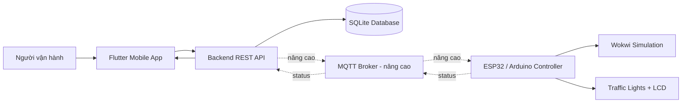
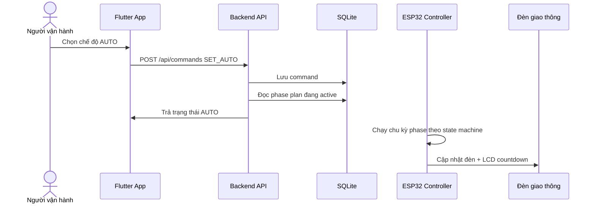
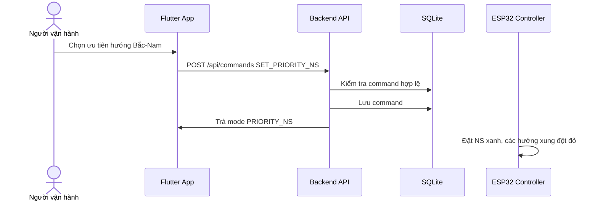
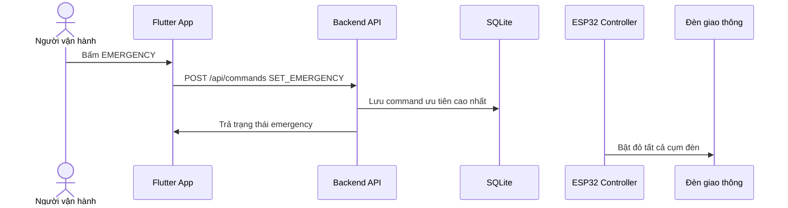
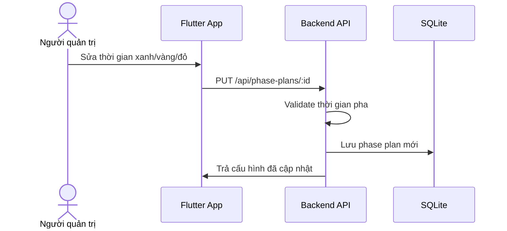
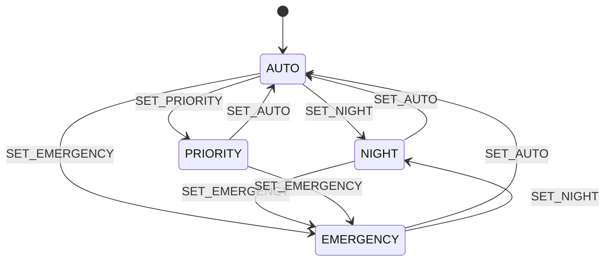
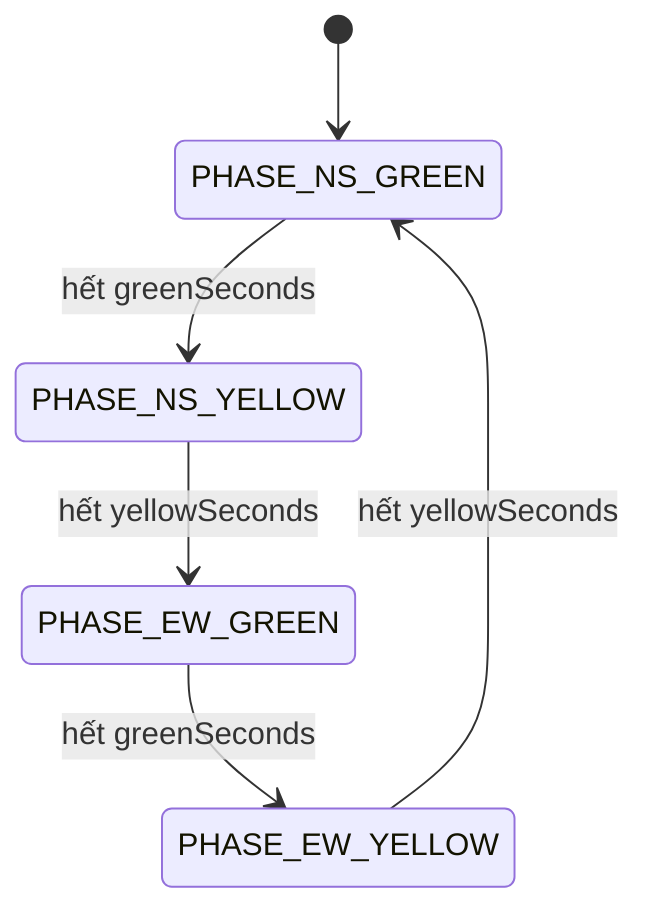
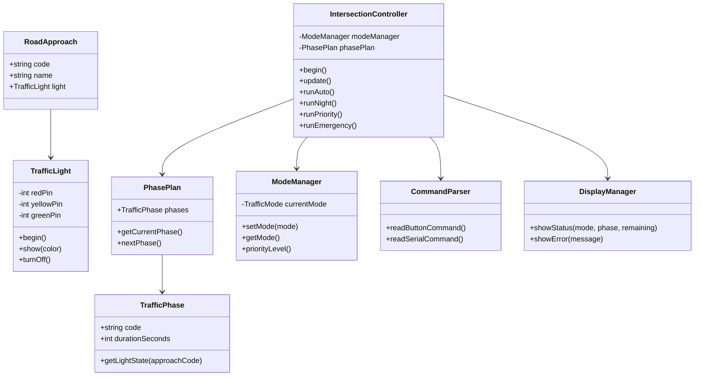
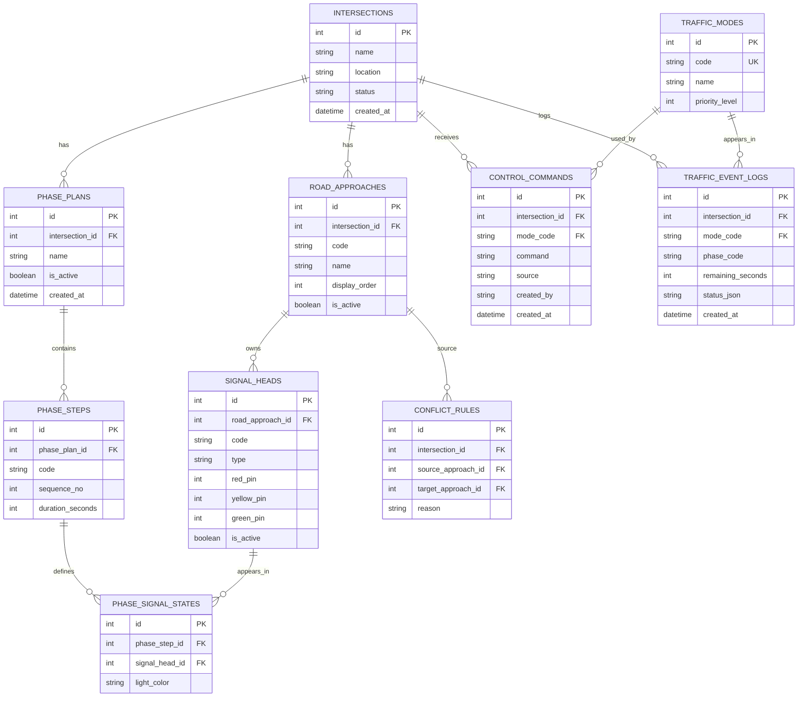

# Plan Triển Khai MVP - Hệ Thống Điều Khiển Đèn Giao Thông Thông Minh

## 1. Định hướng tối ưu

Dự án không nên chỉ dừng ở việc bật/tắt LED trong Wokwi. Hướng triển khai tối ưu cho bài tập lớn là xây dựng một hệ thống MVP có đủ 3 lớp:

1. **Thiết bị điều khiển**: ESP32/Arduino mô phỏng trên Wokwi, điều khiển đèn theo thuật toán trạng thái.
2. **Ứng dụng vận hành**: Flutter mobile app để giám sát, gửi lệnh, cấu hình pha đèn và xem lịch sử.
3. **Backend + Database**: API và SQLite để lưu cấu hình, lịch sử lệnh, log trạng thái và thể hiện thiết kế dữ liệu.

Cách này giúp bài có điểm cộng ở nhiều phần:

- Có mô phỏng IoT bằng ESP32/Arduino.
- Có thuật toán điều khiển và state machine rõ ràng.
- Có OOP trong code thiết bị, backend và Flutter.
- Có database thật hoặc ít nhất có schema rõ ràng.
- Có app mobile thật thay vì chỉ wireframe.
- Có workflow điều khiển từ người dùng đến thiết bị.
- Có thiết kế mở rộng nhiều tuyến đường, không bị khóa cứng ở một ngã tư.

## 2. Phạm vi MVP đề xuất

### 2.1. MVP bắt buộc phải làm

MVP cần đủ chắc để demo và đủ sâu để trình bày trong báo cáo.

| Nhóm chức năng | Nội dung |
|---|---|
| Mô phỏng thiết bị | ESP32/Wokwi điều khiển ít nhất 1 giao lộ gồm 4 hướng: Bắc, Nam, Đông, Tây |
| Logic đèn | AUTO, NIGHT, PRIORITY, EMERGENCY |
| Hiển thị tại thiết bị | LCD 16x2 hiển thị mode, pha hiện tại, countdown |
| Điều khiển tại thiết bị | Nút nhấn hoặc Serial command |
| Flutter app | Dashboard trạng thái, nút đổi mode, cấu hình thời gian pha, lịch sử lệnh |
| Backend API | Nhận command, trả status, lưu command/log/config |
| Database | SQLite gồm bảng giao lộ, tuyến đường, cụm đèn, pha, command, log |
| Báo cáo | Kiến trúc, ERD, state machine, class diagram, workflow, test case, ảnh/video demo |

### 2.2. MVP không nên ôm quá nhiều

Không nên đưa vào bản bắt buộc nếu thời gian gấp:

- Điều khiển realtime Flutter -> Wokwi bằng MQTT nếu chưa test ổn.
- AI tối ưu giao thông.
- Camera nhận diện xe.
- Nhiều giao lộ liên thông.
- Bản đồ GIS thật.
- Authentication phức tạp.

Các phần này có thể đưa vào mục **hướng phát triển nâng cao** để lấy điểm trình bày.

## 3. Lộ trình nâng cấp theo mức điểm

### Mức 1 - MVP đạt yêu cầu

- Wokwi chạy đủ các mode.
- Flutter app chạy local hoặc gọi API.
- Backend SQLite lưu command và status.
- Báo cáo có sơ đồ và giải thích rõ.

### Mức 2 - MVP tốt, có điểm cộng

- Flutter gọi backend API thật.
- Backend lưu SQLite thật.
- App có màn hình quản lý nhiều tuyến đường trong một giao lộ.
- Database thiết kế theo hướng mở rộng N tuyến đường, N cụm đèn.
- Có class diagram cho cả ESP32, Flutter và backend.

### Mức 3 - Nâng cao, gần hệ thống IoT thực tế

- ESP32/Wokwi kết nối WiFi/MQTT.
- Backend publish command qua MQTT.
- ESP32 subscribe command và publish status.
- Flutter đọc trạng thái gần realtime từ backend.
- Có conflict matrix để đảm bảo không bật xanh cho 2 luồng xung đột.

### Mức 4 - Nâng cao để trình bày định hướng

- Thuật toán ưu tiên theo mật độ xe.
- Sensor giả lập xe chờ.
- Nhiều giao lộ liên kết.
- Dashboard phân tích lịch sử.
- Phân quyền operator/admin.

## 4. Kiến trúc tổng thể



### Cách giải thích khi thuyết trình

- **Flutter app** là lớp vận hành.
- **Backend API** là lớp xử lý nghiệp vụ và lưu dữ liệu.
- **Database** lưu cấu hình, lịch sử điều khiển và log.
- **ESP32/Wokwi** là lớp thiết bị điều khiển đèn.
- Trong MVP, Wokwi có thể chạy độc lập bằng nút/Serial, còn Flutter + API chạy luồng điều khiển mô phỏng có lưu DB.
- Trong bản nâng cao, API gửi lệnh thật đến ESP32 qua MQTT/WiFi.

## 5. Workflow hoạt động

### 5.1. Workflow AUTO



### 5.2. Workflow PRIORITY



### 5.3. Workflow EMERGENCY



### 5.4. Workflow cấu hình pha đèn



## 6. Thiết kế mở rộng nhiều tuyến đường

Không nên thiết kế cứng chỉ có `NS` và `EW`. Nên thiết kế theo mô hình:

- Một **intersection** có nhiều **approach/road**.
- Mỗi **approach** có một hoặc nhiều **signal head**.
- Một **phase** gồm nhiều signal head được phép xanh/vàng/đỏ cùng lúc.
- Một **phase plan** là danh sách các phase chạy theo thứ tự.

Ví dụ:

| Giao lộ | Tuyến đường |
|---|---|
| Ngã tư cơ bản | NORTH, SOUTH, EAST, WEST |
| Ngã ba | NORTH, EAST, WEST |
| Ngã năm | NORTH, SOUTH, EAST, WEST, DIAGONAL |
| Giao lộ có rẽ trái riêng | NORTH_STRAIGHT, NORTH_LEFT, EAST_STRAIGHT, EAST_LEFT |

### 6.1. Cách model giao lộ

```text
Intersection
  -> RoadApproach[]
      -> SignalHead[]
  -> PhasePlan[]
      -> PhaseStep[]
          -> SignalState[]
```

### 6.2. Ví dụ phase cho ngã tư 4 hướng

| Phase | Bắc | Nam | Đông | Tây | Ý nghĩa |
|---|---|---|---|---|---|
| P1 | Green | Green | Red | Red | Bắc-Nam đi |
| P2 | Yellow | Yellow | Red | Red | Bắc-Nam chuẩn bị dừng |
| P3 | Red | Red | Green | Green | Đông-Tây đi |
| P4 | Red | Red | Yellow | Yellow | Đông-Tây chuẩn bị dừng |

### 6.3. Ví dụ phase cho ngã ba

| Phase | Bắc | Đông | Tây | Ý nghĩa |
|---|---|---|---|---|
| P1 | Green | Red | Red | Bắc đi |
| P2 | Yellow | Red | Red | Bắc chuẩn bị dừng |
| P3 | Red | Green | Green | Đông-Tây đi |
| P4 | Red | Yellow | Yellow | Đông-Tây chuẩn bị dừng |

### 6.4. Conflict matrix

Để logic chặt chẽ, cần có ma trận xung đột. Hai hướng xung đột không được xanh cùng lúc.

Ví dụ đơn giản:

| Luồng | Xung đột với |
|---|---|
| NORTH_STRAIGHT | EAST_STRAIGHT, WEST_STRAIGHT |
| SOUTH_STRAIGHT | EAST_STRAIGHT, WEST_STRAIGHT |
| EAST_STRAIGHT | NORTH_STRAIGHT, SOUTH_STRAIGHT |
| WEST_STRAIGHT | NORTH_STRAIGHT, SOUTH_STRAIGHT |

Rule bắt buộc:

```text
Không tồn tại hai signal head cùng GREEN nếu chúng nằm trong conflict matrix.
```

## 7. State machine điều khiển

### 7.1. State machine tổng quát



### 7.2. AUTO phase cycle



### 7.3. Quy tắc ưu tiên mode

Thứ tự ưu tiên khi có nhiều lệnh:

1. `EMERGENCY`
2. `PRIORITY`
3. `NIGHT`
4. `AUTO`

Nếu đang emergency thì chỉ một số lệnh được phép thoát:

- `SET_AUTO`
- `SET_NIGHT`
- `CLEAR_EMERGENCY`

Không cho phép command cấu hình pha đèn làm thay đổi trạng thái emergency ngay lập tức.

## 8. Phân tích các trường hợp hoạt động

### 8.1. Trường hợp bình thường

| Case | Input | Expected output |
|---|---|---|
| AUTO mặc định | Hệ thống khởi động | Chạy phase plan active |
| Hết thời gian xanh | Timer = 0 | Chuyển sang vàng |
| Hết thời gian vàng | Timer = 0 | Chuyển sang hướng tiếp theo |
| Người dùng đổi NIGHT | Command SET_NIGHT | Dừng AUTO, vàng nhấp nháy |
| Người dùng đổi EMERGENCY | Command SET_EMERGENCY | Tất cả đỏ |

### 8.2. Trường hợp cấu hình sai

| Case | Vấn đề | Cách xử lý |
|---|---|---|
| greenSeconds = 0 | Pha xanh không hợp lệ | Reject, báo lỗi |
| yellowSeconds quá nhỏ | Không an toàn | Min 2 hoặc 3 giây |
| Phase không có đèn xanh | Không có hướng nào đi | Reject hoặc cảnh báo |
| Hai hướng xung đột cùng xanh | Nguy hiểm | Reject bằng conflict matrix |
| Thiếu phase vàng | Không đúng logic giao thông | Reject phase plan |

### 8.3. Trường hợp app/backend

| Case | Vấn đề | Cách xử lý |
|---|---|---|
| Mất kết nối API | App không gửi được lệnh | Hiển thị offline, lưu draft command |
| API lỗi DB | Không lưu được command | Trả lỗi rõ, không báo thành công giả |
| Người dùng bấm liên tục | Command spam | Debounce/throttle 1-2 giây |
| Hai người gửi lệnh cùng lúc | Race condition | Backend xử lý theo timestamp và priority |
| App reload | Mất state UI | Load status/config/history từ API hoặc local cache |

### 8.4. Trường hợp thiết bị

| Case | Vấn đề | Cách xử lý |
|---|---|---|
| ESP32 reset | Mất state hiện tại | Khởi động lại AUTO |
| LCD lỗi | Không hiển thị | Serial vẫn log trạng thái |
| Nút bị giữ | Lặp command | Debounce và edge detection |
| Serial command sai | Không nhận diện được | In `Unknown command` |
| Timer overflow | `millis()` tràn | Dùng phép trừ unsigned long |

## 9. OOP trên ESP32/Arduino

Code thiết bị cần có các class rõ ràng để giải thích được trong báo cáo.

| Class | Trách nhiệm |
|---|---|
| `TrafficLight` | Điều khiển 3 chân đỏ/vàng/xanh của một cụm đèn |
| `SignalHead` | Mô hình hóa một cụm đèn thuộc một tuyến đường |
| `RoadApproach` | Đại diện một hướng/tuyến đi vào giao lộ |
| `TrafficPhase` | Lưu trạng thái đèn trong một pha |
| `PhasePlan` | Danh sách phase chạy theo thứ tự |
| `ModeManager` | Quản lý mode AUTO/NIGHT/PRIORITY/EMERGENCY |
| `CommandParser` | Đọc nút nhấn hoặc Serial command |
| `DisplayManager` | Cập nhật LCD và Serial output |
| `IntersectionController` | Điều phối toàn bộ logic giao lộ |

### 9.1. Class diagram thiết bị



## 10. OOP trong Flutter

Flutter không chỉ là UI. Cần tách model, repository, controller.

| Layer | Class/Module | Vai trò |
|---|---|---|
| Domain | `TrafficMode` | Enum mode |
| Domain | `LightColor` | Enum màu đèn |
| Domain | `RoadApproach` | Tuyến đường/hướng |
| Domain | `SignalHead` | Cụm đèn |
| Domain | `TrafficPhase` | Pha đèn |
| Domain | `TrafficState` | Trạng thái hiện tại |
| Domain | `ControlCommand` | Lệnh điều khiển |
| Data | `TrafficRepository` | Interface dữ liệu |
| Data | `ApiTrafficRepository` | Gọi backend API |
| Data | `LocalTrafficRepository` | Mock/local storage |
| Presentation | `TrafficController` | Quản lý state cho UI |
| UI | `DashboardScreen` | Màn hình giám sát |
| UI | `ControlScreen` | Màn hình điều khiển |
| UI | `ConfigScreen` | Màn hình cấu hình |
| UI | `HistoryScreen` | Màn hình lịch sử |

### 10.1. Cấu trúc thư mục Flutter đề xuất

```text
flutter_app/
  lib/
    main.dart
    app.dart
    core/
      theme/
      constants/
      widgets/
    features/
      traffic/
        domain/
          light_color.dart
          traffic_mode.dart
          road_approach.dart
          signal_head.dart
          traffic_phase.dart
          traffic_state.dart
          control_command.dart
        data/
          traffic_repository.dart
          api_traffic_repository.dart
          local_traffic_repository.dart
        presentation/
          traffic_controller.dart
          dashboard_screen.dart
          control_screen.dart
          config_screen.dart
          history_screen.dart
          widgets/
            traffic_light_cluster.dart
            mode_button.dart
            countdown_panel.dart
```

## 11. OOP trong Backend

Backend nên đơn giản nhưng có cấu trúc rõ.

| Module/Class | Vai trò |
|---|---|
| `IntersectionService` | Quản lý giao lộ |
| `RoadApproachService` | Quản lý tuyến đường/hướng |
| `PhasePlanService` | Validate và cập nhật phase plan |
| `TrafficCommandService` | Xử lý command |
| `TrafficStatusService` | Tính/trả trạng thái hiện tại |
| `CommandRepository` | Lưu lịch sử command |
| `TrafficLogRepository` | Lưu log trạng thái |
| `PhasePlanRepository` | Lưu cấu hình pha |
| `ConflictValidator` | Kiểm tra xung đột đèn xanh |

Backend có thể dùng một trong hai hướng:

| Công nghệ | Lý do |
|---|---|
| FastAPI + SQLite | Code ngắn, dễ demo API docs |
| Node.js Express + SQLite | Dễ dùng với JavaScript |

Đề xuất chọn **FastAPI + SQLite** nếu muốn nhanh, gọn và dễ trình bày.

## 12. Thiết kế Database

Database nên hỗ trợ nhiều giao lộ, nhiều tuyến đường và nhiều phase plan.

### 12.1. Danh sách bảng

| Bảng | Mục đích |
|---|---|
| `intersections` | Lưu thông tin giao lộ |
| `road_approaches` | Lưu các tuyến/hướng trong một giao lộ |
| `signal_heads` | Lưu cụm đèn thuộc từng tuyến |
| `traffic_modes` | Danh sách mode |
| `phase_plans` | Một bộ cấu hình chu kỳ đèn |
| `phase_steps` | Các bước trong phase plan |
| `phase_signal_states` | Trạng thái từng đèn trong từng phase |
| `conflict_rules` | Quy tắc xung đột giữa các tuyến |
| `control_commands` | Lịch sử lệnh từ app/nút/serial |
| `traffic_event_logs` | Log trạng thái đèn theo thời gian |
| `users` | Tùy chọn, nếu muốn phân quyền cơ bản |

### 12.2. ERD đề xuất



### 12.3. Dữ liệu seed cho MVP

`traffic_modes`:

| code | name | priority_level |
|---|---|---:|
| AUTO | Tự động | 1 |
| NIGHT | Ban đêm | 2 |
| PRIORITY_NS | Ưu tiên Bắc-Nam | 3 |
| PRIORITY_EW | Ưu tiên Đông-Tây | 3 |
| EMERGENCY | Khẩn cấp | 4 |

`road_approaches` cho giao lộ demo:

| code | name | display_order |
|---|---|---:|
| NORTH | Hướng Bắc | 1 |
| SOUTH | Hướng Nam | 2 |
| EAST | Hướng Đông | 3 |
| WEST | Hướng Tây | 4 |

## 13. API đề xuất

### 13.1. Status

| Method | Endpoint | Mục đích |
|---|---|---|
| `GET` | `/api/intersections` | Danh sách giao lộ |
| `GET` | `/api/intersections/{id}/status` | Trạng thái hiện tại |
| `GET` | `/api/intersections/{id}/approaches` | Danh sách tuyến đường |

### 13.2. Command

| Method | Endpoint | Mục đích |
|---|---|---|
| `POST` | `/api/intersections/{id}/commands` | Gửi lệnh đổi mode |
| `GET` | `/api/intersections/{id}/commands` | Lịch sử lệnh |

Body:

```json
{
  "command": "SET_EMERGENCY",
  "modeCode": "EMERGENCY",
  "source": "mobile",
  "createdBy": "operator"
}
```

### 13.3. Phase plan

| Method | Endpoint | Mục đích |
|---|---|---|
| `GET` | `/api/intersections/{id}/phase-plans` | Danh sách phase plan |
| `POST` | `/api/intersections/{id}/phase-plans` | Tạo phase plan |
| `PUT` | `/api/phase-plans/{id}` | Cập nhật phase plan |
| `POST` | `/api/phase-plans/{id}/activate` | Kích hoạt phase plan |

### 13.4. Logs

| Method | Endpoint | Mục đích |
|---|---|---|
| `GET` | `/api/intersections/{id}/logs` | Xem log trạng thái |
| `POST` | `/api/intersections/{id}/logs` | Thiết bị/backend ghi log |

## 14. Logic điều khiển chặt chẽ

### 14.1. Invariant bắt buộc

Các điều kiện luôn phải đúng:

1. Mỗi signal head chỉ có tối đa một màu đang bật.
2. Nếu mode là `EMERGENCY`, tất cả signal head phải đỏ.
3. Nếu mode là `NIGHT`, tất cả signal head vàng nhấp nháy hoặc tắt xen kẽ.
4. Nếu một hướng đang xanh, các hướng xung đột phải đỏ.
5. Mỗi phase trong AUTO phải có duration hợp lệ.
6. Phase xanh phải đi kèm phase vàng trước khi chuyển sang hướng xung đột.
7. Không được áp dụng phase plan mới khi đang emergency, trừ khi người vận hành thoát emergency.

### 14.2. Pseudo-code AUTO tổng quát

```text
currentPhase = phasePlan.steps[currentIndex]
applySignalStates(currentPhase.signalStates)
remaining = currentPhase.durationSeconds - elapsed

if remaining <= 0:
    currentIndex = (currentIndex + 1) % phasePlan.steps.length
    currentPhase = phasePlan.steps[currentIndex]
    validateNoConflict(currentPhase)
    applySignalStates(currentPhase.signalStates)
```

### 14.3. Pseudo-code xử lý command

```text
handleCommand(command):
    if command is invalid:
        reject

    if currentMode == EMERGENCY and command not in allowedExitCommands:
        reject

    save command to database

    switch command:
        SET_AUTO:
            mode = AUTO
            reset phase timer
        SET_NIGHT:
            mode = NIGHT
            start yellow blinking
        SET_PRIORITY_NS:
            mode = PRIORITY_NS
            set north/south green, east/west red
        SET_PRIORITY_EW:
            mode = PRIORITY_EW
            set east/west green, north/south red
        SET_EMERGENCY:
            mode = EMERGENCY
            set all red
```

### 14.4. Validate phase plan

```text
validatePhasePlan(plan):
    assert plan has at least 2 steps
    for each step in plan:
        assert durationSeconds >= minimum
        assert every signal head has exactly one state
        assert no conflicting approaches are green together
    assert every green step has a yellow transition before conflicting green step
```

## 15. Flutter UI đề xuất

### 15.1. Màn hình Dashboard

Hiển thị:

- Tên giao lộ.
- Mode hiện tại.
- Phase hiện tại.
- Countdown.
- 4 cụm đèn Bắc/Nam/Đông/Tây.
- Trạng thái kết nối API.
- Lệnh gần nhất.

### 15.2. Màn hình Control

Nút điều khiển:

- AUTO
- NIGHT
- PRIORITY NS
- PRIORITY EW
- EMERGENCY

Yêu cầu UI:

- EMERGENCY phải nổi bật.
- Khi gửi lệnh phải có loading/disabled ngắn.
- Nếu API lỗi phải báo rõ.
- Không cho bấm spam liên tục.

### 15.3. Màn hình Config

Cho phép:

- Chỉnh `greenSeconds`.
- Chỉnh `yellowSeconds`.
- Chỉnh thứ tự phase ở mức đơn giản.
- Chọn phase plan active.

MVP có thể chỉ cho chỉnh:

- Green duration.
- Yellow duration.
- Night blink interval.

### 15.4. Màn hình Roads

Màn này giúp bài vượt khỏi phạm vi ngã tư cố định.

Cho phép:

- Xem danh sách tuyến đường trong giao lộ.
- Thêm tuyến đường mới ở mức UI/API.
- Bật/tắt tuyến đường.
- Xem signal head thuộc từng tuyến.

Trong MVP, thêm tuyến đường có thể lưu DB và hiển thị trong app; phần Wokwi vẫn demo 4 hướng cố định. Báo cáo cần ghi rõ Wokwi demo 4 hướng, còn mô hình dữ liệu hỗ trợ mở rộng N hướng.

### 15.5. Màn hình History

Hiển thị:

- Thời gian gửi lệnh.
- Command.
- Người gửi.
- Source: mobile, serial, button, api.
- Kết quả: success/failed.

## 16. Backend MVP đề xuất

### 16.1. Công nghệ

Đề xuất:

```text
FastAPI + SQLite
```

Lý do:

- Code nhanh.
- Có Swagger UI tự động.
- Dễ demo API.
- SQLite không cần cài server DB.

### 16.2. Cấu trúc thư mục backend

```text
backend/
  app/
    main.py
    database.py
    models/
      intersection.py
      road_approach.py
      signal_head.py
      phase_plan.py
      command.py
      traffic_log.py
    schemas/
      command_schema.py
      status_schema.py
      phase_plan_schema.py
    repositories/
      command_repository.py
      phase_plan_repository.py
      traffic_log_repository.py
    services/
      command_service.py
      phase_plan_service.py
      status_service.py
      conflict_validator.py
    routers/
      intersections.py
      commands.py
      phase_plans.py
      logs.py
  migrations/
  seed.py
  requirements.txt
```

## 17. ESP32/Wokwi MVP

### 17.1. Thiết bị dùng trong Wokwi

| Thiết bị | Vai trò |
|---|---|
| ESP32 DevKit | Bộ điều khiển chính |
| LED đỏ/vàng/xanh | Cụm đèn giao thông |
| LCD 16x2 I2C | Hiển thị mode, phase, countdown |
| Push button | Đổi mode tại thiết bị |
| Serial Monitor | Gửi command text |

### 17.2. Pin map đề xuất

Giữ theo repo hiện tại:

| Tín hiệu | GPIO |
|---|---:|
| NS_RED | 16 |
| NS_YELLOW | 17 |
| NS_GREEN | 18 |
| EW_RED | 19 |
| EW_YELLOW | 23 |
| EW_GREEN | 25 |
| BTN_AUTO | 26 |
| BTN_NIGHT | 27 |
| BTN_PRIORITY | 32 |
| BTN_EMERGENCY | 33 |
| LCD_SDA | 21 |
| LCD_SCL | 22 |

### 17.3. Nâng cấp Wokwi để trực quan hơn

Hiện repo đang có 2 cụm đèn NS/EW. Nếu muốn trực quan hơn theo yêu cầu 4 đèn giao thông, có thể nâng cấp:

- Tách thành 4 cụm đèn: NORTH, SOUTH, EAST, WEST.
- NORTH và SOUTH cùng trạng thái trong phase NS.
- EAST và WEST cùng trạng thái trong phase EW.
- LCD vẫn hiển thị mode/countdown.

Ưu điểm:

- Nhìn giống ngã tư thật hơn.
- Báo cáo dễ giải thích hơn.
- Vẫn giữ logic không quá phức tạp.

## 18. Kết nối Flutter - Backend - ESP32

### 18.1. MVP ổn định

```text
Flutter -> Backend API -> SQLite
ESP32/Wokwi chạy độc lập bằng button/Serial
```

Khi demo:

1. Mở app Flutter.
2. Gửi lệnh, thấy backend lưu history.
3. Mở Wokwi.
4. Bấm nút hoặc Serial command tương ứng.
5. Giải thích đây là cùng command workflow, bản nâng cao sẽ nối bằng MQTT.

### 18.2. Nâng cao bằng MQTT

```text
Flutter -> Backend API -> MQTT Broker -> ESP32
ESP32 -> MQTT Broker -> Backend API -> Flutter
```

Topic:

| Topic | Ý nghĩa |
|---|---|
| `traffic/intersection-1/commands` | Backend publish command |
| `traffic/intersection-1/status` | ESP32 publish status |
| `traffic/intersection-1/logs` | ESP32 publish event log |

Command message:

```json
{
  "command": "SET_AUTO",
  "modeCode": "AUTO",
  "intersectionId": 1,
  "createdAt": "2026-06-15T10:00:00"
}
```

Status message:

```json
{
  "intersectionId": 1,
  "modeCode": "AUTO",
  "phaseCode": "NS_GREEN",
  "remainingSeconds": 7,
  "signals": [
    { "approach": "NORTH", "color": "GREEN" },
    { "approach": "SOUTH", "color": "GREEN" },
    { "approach": "EAST", "color": "RED" },
    { "approach": "WEST", "color": "RED" }
  ]
}
```

## 19. Test plan

### 19.1. Test ESP32/Wokwi

| Test | Kết quả mong đợi |
|---|---|
| Khởi động | Vào AUTO |
| AUTO chạy hết chu kỳ | NS green -> NS yellow -> EW green -> EW yellow |
| Bấm NIGHT | Vàng nhấp nháy |
| Bấm PRIORITY | Một hướng xanh, hướng xung đột đỏ |
| Bấm EMERGENCY | Tất cả đỏ |
| Gửi Serial `auto` | Quay lại AUTO |
| Gửi command sai | Serial báo unknown command |

### 19.2. Test Backend

| Test | Kết quả mong đợi |
|---|---|
| GET status | Trả mode/phase/current state |
| POST command hợp lệ | Lưu DB và trả success |
| POST command sai | Trả 400 |
| PUT phase config hợp lệ | Lưu config |
| PUT phase config có xung đột | Reject |
| GET command history | Trả danh sách mới nhất |

### 19.3. Test Flutter

| Test | Kết quả mong đợi |
|---|---|
| Mở app | Dashboard load được |
| Bấm AUTO/NIGHT/PRIORITY/EMERGENCY | UI đổi mode |
| API lỗi | Hiển thị lỗi |
| Sửa config | Config lưu và reload không mất |
| Xem history | Có command mới nhất |
| Thêm tuyến đường | Road mới xuất hiện trong danh sách |

### 19.4. Test tích hợp

| Test | Kết quả mong đợi |
|---|---|
| Flutter gửi command | Backend lưu command |
| Flutter đọc status | Status hiển thị đúng |
| Backend restart | DB vẫn còn history |
| Wokwi demo cùng command | Thiết bị thể hiện đúng mode tương ứng |

## 20. Timeline triển khai

### Ngày 1 - Chốt thiết kế và tạo skeleton

- Tạo `plan.md`.
- Chốt MVP 3 lớp.
- Tạo Flutter project.
- Tạo backend skeleton.
- Chuẩn hóa command name và mode name.
- Cập nhật sơ đồ kiến trúc.

Output:

- `flutter_app/`
- `backend/`
- Database schema bản đầu.

### Ngày 2 - Backend + DB

- Tạo SQLite schema.
- Seed giao lộ demo.
- Tạo API status, commands, phase plans.
- Validate command.
- Lưu command history.

Output:

- API chạy được.
- Swagger/API docs.
- DB có dữ liệu demo.

### Ngày 3 - Flutter MVP

- Dashboard.
- Control buttons.
- History.
- Config.
- Roads screen.
- Gọi API thật.

Output:

- App điều khiển được qua backend.
- Có ảnh màn hình.

### Ngày 4 - Wokwi + tích hợp demo

- Test Wokwi runtime.
- Nâng cấp 4 cụm đèn nếu kịp.
- Quay video AUTO/NIGHT/PRIORITY/EMERGENCY.
- Chụp ảnh mạch.
- Kiểm tra command name khớp app/backend.

Output:

- Video/GIF demo.
- Ảnh Wokwi.
- Log test.

### Ngày 5 - Report/slide

- Chèn kiến trúc.
- Chèn ERD.
- Chèn state machine.
- Chèn class diagram.
- Chèn workflow.
- Chèn ảnh Flutter, API, Wokwi.
- Viết phần đã làm và hướng mở rộng.

Output:

- Report PDF.
- Slide.
- Demo package.

## 21. Phân công 2 thành viên

| Thành viên | Nhiệm vụ chính |
|---|---|
| Nguyễn Xuân Hải | Owner chính toàn bộ triển khai kỹ thuật: Flutter app, backend API, ESP32/Wokwi, logic điều khiển, tích hợp demo, kiểm thử, quay video |
| Trần Đình Đức | Hỗ trợ Database/ERD, tài liệu báo cáo và PowerPoint |

### Nguyễn Xuân Hải

- Tạo Flutter UI.
- Làm dashboard/control/history/config.
- Tích hợp API.
- Thiết kế và viết backend API.
- Hoàn thiện logic ESP32/Wokwi.
- Áp dụng OOP trong ESP32, Flutter và backend.
- Thiết kế state machine và kiểm tra conflict matrix.
- Test app.
- Chụp ảnh app.
- Test Wokwi và quay demo.
- Tích hợp toàn bộ demo cuối.
- Review nội dung báo cáo/slide trước khi nộp.

### Trần Đình Đức

- Thiết kế DB/ERD.
- Viết mô tả database schema.
- Chuẩn bị nội dung tài liệu báo cáo theo phần được giao.
- Làm PowerPoint/slide trình bày.
- Hỗ trợ chèn ERD, bảng database và nội dung docs vào báo cáo/slide.

## 22. Nội dung cần đưa vào báo cáo để tối đa điểm

### 22.1. Chương 1 - Giới thiệu

- Lý do chọn đề tài.
- Mục tiêu hệ thống.
- Phạm vi MVP.
- Điểm khác biệt: không chỉ mô phỏng LED, có app, backend, DB, OOP.

### 22.2. Chương 2 - Phân tích yêu cầu

- Actor: operator, admin, device.
- Use case.
- Functional requirements.
- Non-functional requirements.
- Các trường hợp đặc biệt.

### 22.3. Chương 3 - Thiết kế hệ thống

- Kiến trúc tổng thể.
- Workflow.
- ERD.
- State machine.
- Class diagram.
- API contract.

### 22.4. Chương 4 - Triển khai

- ESP32/Wokwi.
- Flutter app.
- Backend API.
- SQLite database.
- OOP được áp dụng ở đâu.

### 22.5. Chương 5 - Kiểm thử

- Test case thiết bị.
- Test case app.
- Test case API.
- Test case logic an toàn.
- Ảnh/video kết quả.

### 22.6. Chương 6 - Kết luận và hướng phát triển

- Đã hoàn thành gì.
- Giới hạn hiện tại.
- Nâng cấp MQTT.
- Nâng cấp nhiều giao lộ.
- Nâng cấp sensor/AI.

## 23. Checklist hoàn thành

### Thiết bị

- [ ] Wokwi chạy AUTO.
- [ ] Wokwi chạy NIGHT.
- [ ] Wokwi chạy PRIORITY.
- [ ] Wokwi chạy EMERGENCY.
- [ ] LCD hiển thị đúng.
- [ ] Button/Serial command hoạt động.
- [ ] Có ảnh và video demo.

### Flutter

- [ ] Dashboard trạng thái.
- [ ] Control mode.
- [ ] Config phase.
- [ ] History command.
- [ ] Roads/approaches screen.
- [ ] Gọi backend API.
- [ ] UI mobile trực quan.

### Backend/DB

- [ ] SQLite schema.
- [ ] Seed data.
- [ ] API status.
- [ ] API command.
- [ ] API phase plan.
- [ ] API logs.
- [ ] Validate phase/conflict.

### Tài liệu

- [ ] Kiến trúc tổng thể.
- [ ] ERD.
- [ ] State machine.
- [ ] Class diagram.
- [ ] Workflow sequence.
- [ ] Test case.
- [ ] Report PDF.
- [ ] Slide.

## 24. Kết luận hướng triển khai

Hướng tối ưu là xây dựng một MVP gồm:

```text
Flutter Mobile App + Backend API + SQLite Database + ESP32/Wokwi Simulation
```

Trong đó:

- ESP32/Wokwi chứng minh phần IoT và điều khiển thiết bị.
- Flutter chứng minh phần mobile app vận hành.
- Backend/API chứng minh hệ thống không chỉ là UI mock.
- SQLite/ERD chứng minh năng lực thiết kế database.
- OOP được áp dụng xuyên suốt ở thiết bị, backend và app.
- Mô hình dữ liệu hỗ trợ nhiều tuyến đường, nhiều cụm đèn, nhiều phase plan.

Đây là phạm vi vừa đủ thực tế cho bài tập lớn, có thể demo được, giải thích được và có nhiều điểm cộng kỹ thuật mà vẫn không bị quá tải.
