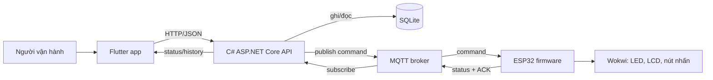
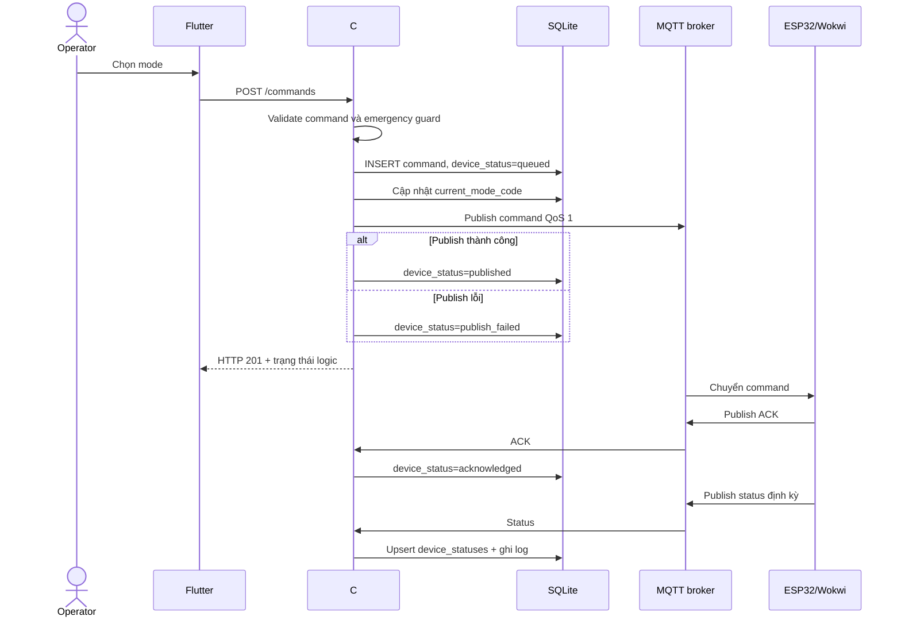
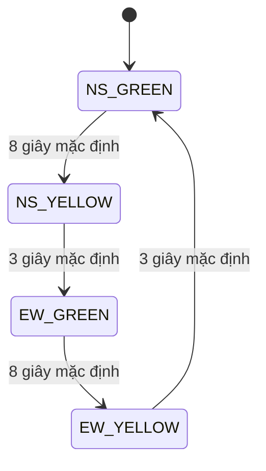

# Báo cáo kỹ thuật hệ thống đèn giao thông IoT

> Trạng thái tài liệu: đối chiếu repository ngày 15/06/2026. Tài liệu mô tả đúng trạng thái mã nguồn hiện có, không khẳng định thay cho kiểm thử phần cứng hoặc nghiệm thu thực tế.

## 1. Quy ước mức độ xác nhận

| Nhãn | Ý nghĩa |
|---|---|
| **Đã xác nhận từ mã nguồn** | Có implementation cụ thể trong repository và đã đọc đối chiếu. |
| **Đã xác nhận từ artifact** | Có sản phẩm build tồn tại trong workspace, nhưng chưa mặc nhiên chứng minh đã cài và chạy trên thiết bị thật. |
| **Có ghi nhận kiểm thử** | File trạng thái của dự án ghi nhận đã chạy thành công, nhưng lượt rà soát tài liệu này không chạy lại để tránh ghi ra ngoài `report/**` và `docs/**`. |
| **Chưa kiểm chứng runtime** | Mã đã có nhưng chưa có log, ảnh, video hoặc phiên chạy được kiểm tra độc lập trong lượt này. |
| **Thiết kế/đề xuất** | Hướng phát triển, chưa phải chức năng hiện có. |

## 2. Phạm vi hệ thống hiện tại

Hệ thống gồm bốn khối chính:

1. **Flutter**: ứng dụng vận hành trên Android/web/Windows, gọi REST API.
2. **C# ASP.NET Core 8**: API, xử lý nghiệp vụ, ghi SQLite và làm cầu nối MQTT.
3. **SQLite và MQTT**:
   - SQLite lưu cấu hình, lịch sử lệnh, log và trạng thái thiết bị.
   - MQTT vận chuyển lệnh, trạng thái và ACK giữa backend với ESP32.
4. **ESP32/Wokwi**: chạy state machine, điều khiển LED/LCD, nhận lệnh MQTT và phát trạng thái.

Đường đi đúng là `Flutter -> C# API -> MQTT -> ESP32/Wokwi`. Flutter không kết nối trực tiếp đến ESP32. SQLite và MQTT là hai nhánh trách nhiệm khác nhau của backend, không phải hai bước thay thế nhau.

## 3. Thành phần và bằng chứng trong repository

| Thành phần | Implementation | Mức xác nhận |
|---|---|---|
| Flutter operator app | `flutter_app/lib/main.dart` | Đã xác nhận từ mã nguồn |
| REST API và MQTT bridge | `backend/Program.cs` | Đã xác nhận từ mã nguồn |
| CSDL | `backend/schema.sql` và logic tạo `traffic.db` khi runtime | Đã xác nhận từ mã nguồn; file `.db` là artifact local không commit |
| Firmware ESP32 | `wokwi/sketch.ino` | Đã xác nhận từ mã nguồn |
| Mạch mô phỏng | `wokwi/diagram.json` | Đã xác nhận từ mã nguồn |
| APK release | Build script `scripts/build-flutter-android.ps1` -> `dist/android/iot-traffic-light-v1.0.0.apk` | Đã có ghi nhận build release ngày 15/06/2026; file output không phải lúc nào cũng nằm sẵn trong repo |
| Backend build/smoke/integration test | Release build và 8 integration tests | Đã chạy lại cục bộ ngày 15/06/2026 |
| MQTT end-to-end | Backend command history và device status | Đã xác nhận runtime: device `wokwi-esp32-01`, command IDs 22-26 `acknowledged` |
| Ảnh/video Wokwi | `assets/wokwi/wokwi_*.png` | Đã có ảnh compile/run và 5 ảnh mode; chưa có video cuối |

## 4. Luồng dữ liệu chính

### 4.1. Đọc dashboard

Flutter gọi `GET /api/intersections/1/dashboard`. Backend trả về:

- trạng thái logic hiện tại;
- danh sách hướng đường và signal head;
- phase plan;
- lịch sử command;
- traffic log;
- mode;
- trạng thái thiết bị nhận qua MQTT.

Flutter tải snapshot đầy đủ khi refresh, sau đó gọi `GET /api/intersections/1/status` mỗi giây khi đang online.

Điểm cần phân biệt: endpoint `/status` hiện tính trạng thái từ `current_mode_code`, phase plan và đồng hồ của backend. Nó chưa ưu tiên trạng thái mới nhất do ESP32 gửi. Vì vậy dashboard có thể hiển thị trạng thái logic của backend dù thiết bị chưa nhận được lệnh hoặc đang lệch pha.

### 4.2. Gửi command

## 5. Command lifecycle thực tế

Hai cột trong `control_commands` có ý nghĩa khác nhau:

- `status`: kết quả nghiệp vụ ở API, hiện là `success` hoặc `rejected`.
- `device_status`: tiến độ gửi đến thiết bị.

| `device_status` | Khi nào xuất hiện | Điều đã được chứng minh |
|---|---|---|
| `not_sent` | Lệnh không hợp lệ hoặc bị emergency guard từ chối | API không gửi MQTT |
| `queued` | Lệnh hợp lệ vừa được lưu | Backend đã nhận và lưu lệnh |
| `published` | MQTT client publish thành công | Broker/API client đã chấp nhận thao tác publish, chưa chứng minh ESP32 đã xử lý |
| `acknowledged` | ESP32 gửi ACK có cùng `commandId` | Firmware đã nhận và gọi xử lý command |
| `publish_failed` | Không kết nối/publish được MQTT | Lệnh chưa được giao đến broker |

Trong yêu cầu trình bày, từ **failed** nên được hiểu là `publish_failed` ở implementation hiện tại. Chưa có trạng thái `ack_timeout`, `device_rejected`, retry tự động hoặc dead-letter queue.

`queued` là trạng thái chuyển tiếp rất ngắn vì API thực hiện publish đồng bộ trước khi trả HTTP response. Khi Flutter refresh history, lệnh thường đã là `published` hoặc `publish_failed`.

Một hạn chế quan trọng: API vẫn trả `CommandResult.Status = "success"` sau khi command hợp lệ, kể cả khi publish MQTT thất bại. Vì vậy không được diễn giải HTTP `201` là thiết bị đã đổi đèn. Bằng chứng mạnh nhất hiện có là `device_status=acknowledged` kết hợp với status mới từ thiết bị.

## 6. OOP đã triển khai

### 6.1. Firmware ESP32

| Class/kiểu | Trách nhiệm |
|---|---|
| `TrafficLight` | Đóng gói ba GPIO đỏ, vàng, xanh và thao tác hiển thị màu |
| `RoadApproach` | Mô hình hóa hướng đường và chứa tham chiếu đến `TrafficLight` |
| `ModeManager` | Quản lý mode, debounce nút nhấn, Serial command và external command |
| `DisplayManager` | Cập nhật LCD và Serial |
| `IntersectionController` | Điều phối state machine, timer và trạng thái bốn hướng |
| `MqttClientManager` | WiFi/MQTT reconnect, subscribe command, publish ACK/status |
| `TrafficPhase` | Cấu trúc dữ liệu một pha AUTO |

OOP thể hiện rõ qua đóng gói và composition. Firmware không dùng inheritance hoặc polymorphism; không nên trình bày là đã áp dụng đầy đủ mọi trụ cột OOP.

### 6.2. Backend C#

| Thành phần | Trách nhiệm |
|---|---|
| `TrafficDatabase` | Mở SQLite, tạo schema, tương thích schema cũ và seed dữ liệu |
| `TrafficRepository` | Truy vấn và ghi dữ liệu |
| `TrafficService` | Validate command, emergency guard, phase duration và tạo status |
| `MqttTrafficBridge` | `BackgroundService` kết nối broker, publish và xử lý status/ACK |
| `ITrafficCommandPublisher` | Abstraction cho việc publish command |
| Các `record` DTO | Mô tả request, response và message MQTT |

Backend dùng dependency injection, interface, repository/service và DTO. Hạn chế là toàn bộ API, data access, service và MQTT bridge vẫn nằm trong một file `Program.cs`, phù hợp MVP nhưng chưa phải cấu trúc production dễ bảo trì.

### 6.3. Flutter

| Thành phần | Trách nhiệm |
|---|---|
| `TrafficHomePage` và state | Điều phối navigation, loading, polling và use case |
| `ApiClient` | Đóng gói GET/POST/PUT, timeout và lỗi HTTP |
| `DashboardSnapshot`, `TrafficStatus`, `SignalStatus`, `Approach`, `PhasePlan` | Domain/view model và JSON mapping |
| Các widget `DashboardView`, `ControlView`, `ManageView`, `HistoryView`, `SettingsView` | Tách presentation theo màn hình |

Flutter đã áp dụng class, encapsulation, composition và model mapping. Tuy nhiên toàn bộ app nằm trong một file, dùng `setState` trực tiếp và chưa có repository/state-management layer độc lập. Đây là OOP ở mức MVP, không nên mô tả là clean architecture hoàn chỉnh.

## 7. State machine và an toàn xung đột

### 7.1. State machine đã có

AUTO gồm bốn pha cố định:

Các mode ngoài AUTO:

- `NIGHT`: tất cả đèn vàng chớp chu kỳ 500 ms.
- `PRIORITY_NS`: Bắc/Nam xanh, Đông/Tây đỏ.
- `PRIORITY_EW`: Đông/Tây xanh, Bắc/Nam đỏ.
- `EMERGENCY`: tất cả đỏ.

### 7.2. Biện pháp an toàn đã có

- Bảng phase firmware cố định không cho hai trục xung đột cùng xanh.
- Phase plan seed trong backend cũng đặt trục còn lại đỏ.
- `EMERGENCY` ép tất cả đỏ.
- Backend chặn `PRIORITY_NS` và `PRIORITY_EW` khi mode hiện tại là `EMERGENCY`.
- `conflict_rules` và hàm kiểm tra conflict có trong backend; lỗi được trả trong `conflictErrors`.
- Khi đổi mode, firmware tắt toàn bộ đèn trước khi áp dụng mode mới.

### 7.3. Giới hạn an toàn chưa giải quyết

- Không có pha **all-red clearance** có thời lượng giữa hai trục hoặc khi đổi priority.
- Thao tác tắt toàn bộ rồi bật mode mới xảy ra gần như ngay trong cùng vòng lặp, không phải interlock có thời gian.
- `conflictErrors` hiện chỉ là thông tin đọc ra; chưa chặn tạo/kích hoạt phase plan nguy hiểm.
- Backend và firmware chạy hai đồng hồ state machine độc lập; chưa có đồng bộ phase/timestamp.
- Backend cập nhật `current_mode_code` trước khi biết MQTT publish có thành công hay không.
- Không có command expiry, idempotency, retry, sequence number hoặc chống ACK trễ.
- Không có watchdog đưa thiết bị về all-red khi lỗi logic; khi mất MQTT, firmware tiếp tục mode cục bộ gần nhất.
- Firmware parse JSON thủ công bằng tìm chuỗi, chưa dùng parser JSON có validate schema.
- Bốn hướng NORTH/SOUTH/EAST/WEST là bốn đối tượng logic nhưng NORTH/SOUTH dùng chung một bộ GPIO, EAST/WEST dùng chung một bộ GPIO. Mô hình vật lý hiện chỉ có hai kênh điều khiển độc lập.

Do đó hệ thống phù hợp bài tập mô phỏng, chưa đủ điều kiện điều khiển giao thông ngoài thực tế.

## 8. Demo bằng điện thoại

Hai cách demo khả thi:

### Cách A: cùng WiFi, backend chạy trên laptop

1. Chạy backend trên laptop tại port `8000`.
2. Chạy Wokwi trên laptop để ESP32 kết nối broker.
3. Cài APK lên điện thoại Android.
4. Điện thoại và laptop vào cùng mạng WiFi.
5. Trong Flutter Settings, nhập `http://<IPv4-laptop>:8000`.
6. Nhấn **Test**, kiểm tra trạng thái `Connected`.
7. Gửi lần lượt `AUTO`, `NIGHT`, `PRIORITY NS/EW`, `EMERGENCY`.
8. Đối chiếu ba bằng chứng: đèn/LCD Wokwi, command history và ESP32 last seen.

### Cách B: backend deploy công khai

1. Deploy backend Docker lên Render.
2. Dùng URL HTTPS của Render trong Flutter Settings.
3. Chạy Wokwi ở bất kỳ máy nào có Internet.
4. Demo app trên điện thoại qua 4G/WiFi.

Chi tiết thao tác và checklist nằm tại [docs/demo_dien_thoai.md](../docs/demo_dien_thoai.md).

## 9. Đánh giá tiêu chí môn IoT

### Đã đạt ở mức source/implementation

- Mô phỏng ESP32/Wokwi với LED, LCD, nút nhấn.
- AUTO, NIGHT, PRIORITY_NS, PRIORITY_EW, EMERGENCY.
- State machine không dùng delay dài cho chu kỳ chính.
- OOP ở firmware, backend và Flutter.
- REST API C# thật, SQLite thật.
- MQTT command/status/ACK đã được cài đặt trong mã.
- Dashboard Flutter có control, quản lý phase/road, history và settings.
- Schema mở rộng cho intersection, approach, signal head, phase plan, command, device status và log.

### Chưa đạt hoặc chưa đủ bằng chứng

- Đã có ảnh Wokwi thực trong `assets/wokwi/`; chưa có video/GIF cuối.
- Chưa có report PDF và slide hoàn chỉnh trong `report/`/`slides/`.
- Đã có evidence log cho lượt API -> MQTT -> ESP32 -> ACK -> status; còn thiếu video quay từ điện thoại thật.
- Chưa kiểm chứng cài APK trên điện thoại thật trong lượt rà soát này.
- Đã có integration test cho command lifecycle, publish failure, phase plan, road update và ACK scoping; chưa có test ACK timeout/conflict enforcement đầy đủ.
- Chưa chứng minh Wokwi compile/run từ chính trạng thái working tree hiện tại bằng artifact log.

Ma trận chi tiết theo FR/ER/NFR nằm tại [docs/ma_tran_tieu_chi_iot.md](../docs/ma_tran_tieu_chi_iot.md).

## 10. Production gap

| Nhóm | Khoảng trống hiện tại | Hướng xử lý |
|---|---|---|
| Bảo mật API | CORS mở toàn bộ, không authentication/authorization | HTTPS, JWT/OIDC, role operator/admin, rate limit |
| Bảo mật MQTT | Public broker, topic đoán được, TCP 1883 không credential mặc định | Broker riêng, TLS, username/certificate, ACL theo device/topic |
| Tính đúng trạng thái | Backend state có thể khác device state | Device-reported state là nguồn sự thật, lưu desired/reported state riêng |
| Độ tin cậy command | Không retry, timeout, expiry, idempotency | Outbox, retry policy, ACK deadline, deduplication |
| An toàn đèn | Không all-red clearance và enforcement conflict | Safety state machine độc lập, validate trước activate, fail-safe all-red |
| Dữ liệu | SQLite local không phù hợp scale/deploy free lâu dài | PostgreSQL managed, migration và backup |
| Thiết bị | Hai bộ GPIO cho bốn hướng logic | GPIO/driver riêng, relay/driver đúng chuẩn nếu làm phần cứng |
| Quan sát hệ thống | Chưa có structured metrics/alerts | Correlation ID, metrics, health/readiness, alert MQTT offline |
| Chất lượng | Test coverage rất mỏng | Unit, integration, contract và end-to-end tests |
| Phát hành mobile | Application ID mẫu, ký bằng debug key | Package ID thật, release keystore, secret management |

## 11. Kết luận trung thực

Đây là một MVP bài lớn có đủ chiều sâu để trình bày kiến trúc IoT: app Flutter, backend C#, database, MQTT và firmware OOP. Phần mạnh nhất là đã có luồng command/status/ACK trong mã thay vì chỉ mock giao diện.

Giới hạn lớn nhất là bằng chứng runtime chưa được đóng gói đầy đủ và safety model mới ở mức mô phỏng. Khi thuyết trình nên dùng câu: **“Hệ thống đã triển khai luồng end-to-end trong mã và có ghi nhận kiểm thử cục bộ; nhóm vẫn cần bổ sung video/log nghiệm thu và các cơ chế an toàn trước khi coi là production.”**
