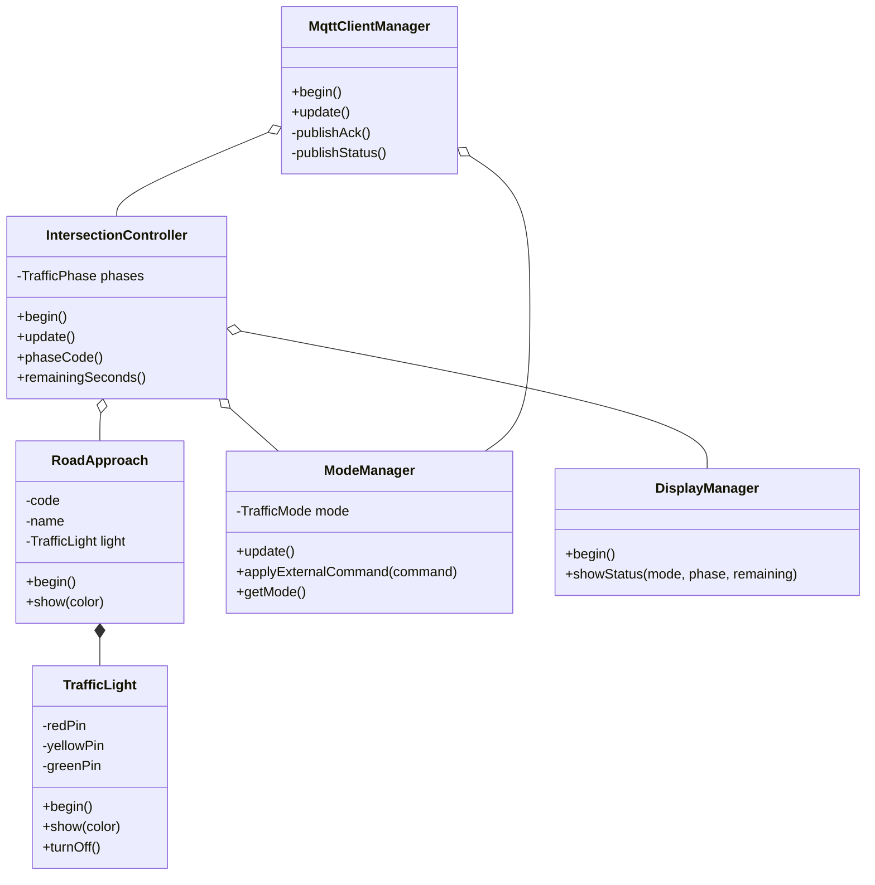
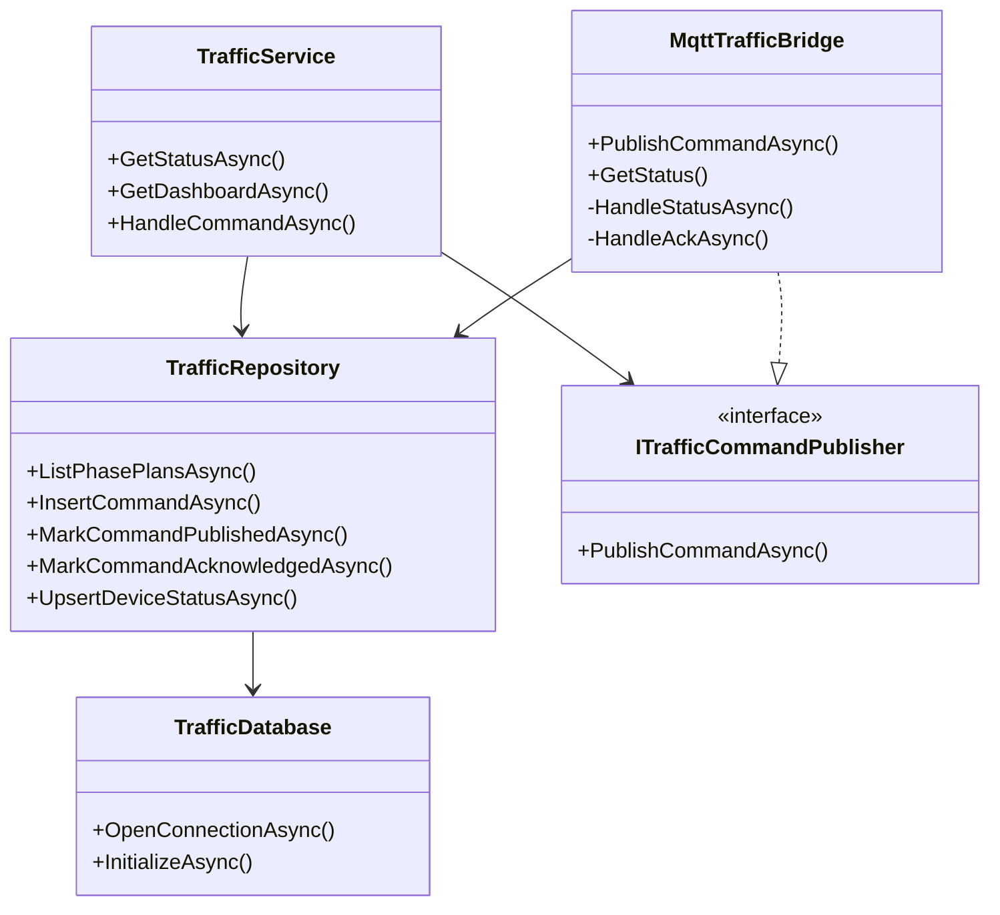

# Phụ lục OOP đã triển khai

> Phụ lục này bám theo mã nguồn ngày 15/06/2026. Nội dung mô tả OOP thực tế, không suy rộng thành clean architecture hoặc production architecture.

## 1. Tổng quan

OOP được áp dụng ở cả ba lớp:

- Firmware ESP32: đóng gói GPIO, mode, hiển thị, state machine và MQTT.
- Backend C#: database, repository, service, MQTT bridge và DTO.
- Flutter: widget, API client và domain/view model.

Mẫu thiết kế chính là **encapsulation**, **composition**, phân tách trách nhiệm và dependency injection. Inheritance/polymorphism chỉ xuất hiện ở mức framework, không phải trọng tâm domain.

## 2. Firmware ESP32/Wokwi

Nguồn: `wokwi/sketch.ino`.

| Thành phần | Trách nhiệm | Giá trị OOP |
|---|---|---|
| `TrafficLight` | Quản lý chân đỏ/vàng/xanh | Ẩn chi tiết GPIO |
| `RoadApproach` | Tên, mã và đèn của một hướng | Mô hình hóa domain |
| `ModeManager` | Nút, Serial, external command, mode | Tách input khỏi state machine |
| `DisplayManager` | LCD và Serial | Single responsibility |
| `IntersectionController` | Pha, timer, màu đèn | Composition và điều phối domain |
| `MqttClientManager` | Kết nối, subscribe, publish | Tách giao tiếp khỏi điều khiển |
| `TrafficPhase` | Dữ liệu một pha | Value-like domain structure |

### Giới hạn cần nêu

- `TrafficPhase` là `struct`, không phải class có hành vi.
- Không có hierarchy cho các mode hoặc strategy riêng.
- NORTH/SOUTH dùng hai object `TrafficLight` khác nhau nhưng trùng cùng bộ GPIO; EAST/WEST cũng vậy. Bốn hướng là bốn object logic nhưng chỉ có hai kênh vật lý độc lập.
- Firmware parse payload JSON bằng thao tác chuỗi.

## 3. Backend C#

Nguồn: `backend/Program.cs`.

| Thành phần | Trách nhiệm |
|---|---|
| `TrafficDatabase` | Connection, schema, seed, compatibility migration |
| `TrafficRepository` | CRUD và query SQLite |
| `TrafficService` | Business rule, status, command lifecycle |
| `ITrafficCommandPublisher` | Hợp đồng publish command |
| `MqttTrafficBridge` | Background MQTT client và adapter message |
| `MqttBridgeOptions` | Cấu hình từ environment |
| DTO `record` | Request/response/message có kiểu rõ ràng |

### Điểm OOP/clean code đã có

- Dependency injection từ ASP.NET Core.
- Interface tách `TrafficService` khỏi implementation MQTT cụ thể.
- Repository tách SQL khỏi phần lớn business rule.
- DTO record giúp contract rõ ràng.
- Parameterized SQL cho dữ liệu đầu vào.

### Giới hạn cần nêu

- Toàn bộ lớp nằm trong một file `Program.cs`.
- Chưa có domain aggregate hoặc transaction bao trọn cập nhật mode, log và publish.
- Repository trả nhiều `Dictionary<string, object?>`, làm giảm type safety.
- Chưa có implementation giả của `ITrafficCommandPublisher` cho unit test.
- API trả thành công nghiệp vụ dù MQTT publish có thể thất bại.

## 4. Flutter

Nguồn: `flutter_app/lib/main.dart`.

| Nhóm class | Vai trò |
|---|---|
| `TrafficOperatorApp`, `TrafficHomePage` | App shell và state điều phối |
| `ApiClient`, `ApiException` | HTTP data access và lỗi |
| `DashboardSnapshot`, `TrafficStatus`, `SignalStatus` | Snapshot và trạng thái đèn |
| `Approach`, `PhasePlan`, `PhaseStep` | Model quản lý hướng đường và pha |
| `CommandEntry`, `TrafficLog` | Model history/log |
| Các `...View`, `...Card`, `...Tile` | Presentation components |

### Điểm OOP đã có

- Model tự chịu trách nhiệm map JSON qua factory constructor.
- `ApiClient` đóng gói transport và timeout.
- Widget composition chia UI thành các phần nhỏ.
- Callback được truyền qua constructor, giúp giảm phụ thuộc trực tiếp giữa widget con và API.

### Giới hạn cần nêu

- State, use case và presentation vẫn tập trung trong một file.
- Dùng `setState` và polling 1 giây; chưa có state-management/repository riêng.
- API URL chỉ thay đổi trong phiên chạy hiện tại, chưa persist.
- Widget test mới kiểm tra app render, chưa kiểm tra command/history/error state.

## 5. Cách trình bày trong báo cáo

Nên trình bày:

> Dự án áp dụng OOP theo hướng đóng gói thiết bị, phân tách trách nhiệm và composition. Firmware có controller/mode/display/MQTT manager; backend có database/repository/service/MQTT publisher; Flutter có API client, model và widget theo màn hình.

Không nên trình bày:

> Dự án đã áp dụng đầy đủ clean architecture, SOLID và production-grade OOP.

Mã hiện tại đủ chứng minh tư duy OOP cho bài lớn, nhưng vẫn là cấu trúc MVP cần tách module và bổ sung test nếu phát triển dài hạn.
